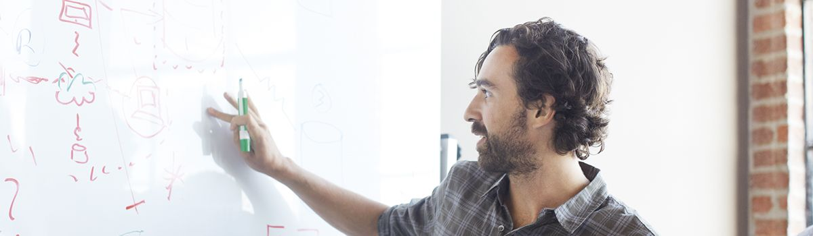

# Microsoft AI & IoT Insider Labs

Microsoft’s IoT & AI Insider Labs are facilities to help you develop, prototype and test IoT and AI solutions for market commercialization. Located in Redmond, USA; Munich, Germany; and Shenzhen, China; they are located at the heart of Microsoft’s product group, industrial and manufacturing solutions.

## Purpose

GBB/Industry/GPS/ATU can all nominate to the Insider Labs. 

Quick summary:
- Required Non-Disclosure Agreement
- It's personalized 1 to 1 experience with our dedicated engineers, data scientists, and program managers
- Open to customer, startups or partner
- Best if there's clearly documented business/technical requirements, committed to using MSFT AI/IoT tech
- Runs as sprints with hackathon sessions to guide ISV to architecture & guide through implementation
- Nomination [here](https://aiotlabs.microsoft.com/p/apply)

## References

Source | Description | Notes
:----- | :-----  | :-----
[Microsoft AI & IoT Insider Labs](https://aiotlabs.microsoft.com/p/apply)| Microsoft AI & IoT Insider Labs

