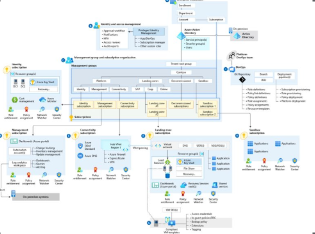

# Azure Infrastructure - Landing Zones
[< Back to Crucible](./)

## Purpose

A Collection of resources for Microsoft practice building in the **Azure Landing Zones**. For a view of other solution areas, please see the [Taxonomy](Taxonomy.md).

To contribute to the PartnerCrucible, see [Contributor's Guide](ContributorsGuide).

## References

Source | Description | Notes
:----- | :---------- | :-----
[Tailor the Azure landing zone architecture to meet requirements](https://learn.microsoft.com/en-gb/azure/cloud-adoption-framework/ready/landing-zone/tailoring-alz) | Because not all use cases are the same, not all organizations can use an implementation approach in the exact way it was intended. You need to understand the considerations when a requirement for tailoring is identified | Microsoft Learn
[Testing approach for Azure landing zones](https://learn.microsoft.com/en-ca/azure/cloud-adoption-framework/ready/enterprise-scale/testing-approach) | The canary management group hierarchy can be independently used to author and test deployments before you deploy them into the production environment. | Microsoft Learn
[AKS Landing Zone Accelerator](https://learn.microsoft.com/en-us/azure/cloud-adoption-framework/scenarios/app-platform/aks/landing-zone-accelerator) |  The following guidance provides design considerations for implementing a scalable AKS cluster in your landing zone. | Microsoft Learn
[APIM Landing Zone Accelerator](https://learn.microsoft.com/en-us/azure/cloud-adoption-framework/scenarios/app-platform/api-management/landing-zone-accelerator) | The Azure API Management landing zone accelerator provides an architectural approach and reference implementation to prepare landing zone subscriptions for a scalable API Management infrastructure. | Microsoft Learn
[Azure App Service landing zone accelerator](https://learn.microsoft.com/en-us/azure/cloud-adoption-framework/scenarios/app-platform/app-services/landing-zone-accelerator) | The Azure App Service landing zone accelerator is an open-source collection of architectural guidance and reference implementation to accelerate deployment of Azure App Service at scale | Microsoft Learn
[Azure Red Hat OpenShift landing zone accelerator](https://learn.microsoft.com/en-us/azure/cloud-adoption-framework/scenarios/app-platform/azure-red-hat-openshift/landing-zone-accelerator) | The Azure Red Hat OpenShift landing zone accelerator is a collection of design guidance and implementation references to accelerate deployment of Azure Red Hat OpenShift clusters in your landing zone. | Microsoft Learn
[Cloud-scale analytics data management landing zone overview](https://learn.microsoft.com/en-us/azure/cloud-adoption-framework/scenarios/cloud-scale-analytics/architectures/data-management-landing-zone) | The data management landing zone is a management function and is central to cloud-scale analytics. It's responsible for the governance of your analytics platform. | Microsoft Learn
[Independent software vendor (ISV) considerations for Azure landing zones](https://learn.microsoft.com/en-ca/azure/cloud-adoption-framework/ready/landing-zone/isv-landing-zone?tabs=mg-env-no%2Cminimal) |The landing zones describe how to build an Azure environment with multiple subscriptions. Each landing zone accounts for scale, security, governance, networking, and identity, and is based on feedback and lessons learned from many customers. | Microsoft Learn

[< Back to Crucible](./)