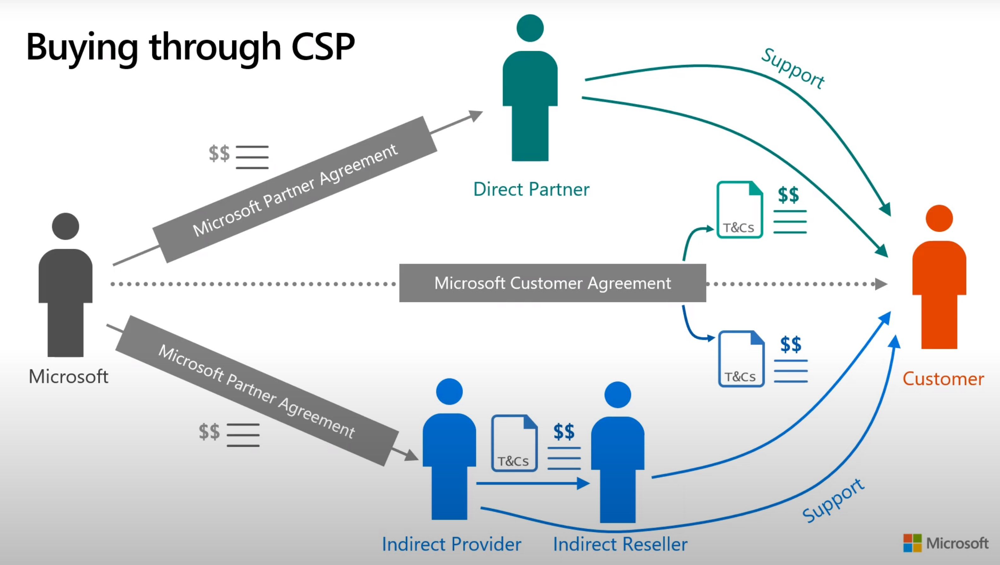

# Cloud Solution Provider Program

## Purpose

To contribute to the PartnerCrucible, see [Contributor's Guide](ContributorsGuide).

## Communities

Source | Description | Notes
:----- | :-----  | :-----
[Cloud Solution Provider (CSP) partners](https://techcommunity.microsoft.com/category/mcpp/discussions/cloudservicesproviderspartners) | This board is the go-to space for Microsoft Cloud Solution Provider (CSP) partners—both direct bill and indirect resellers—to collaborate, troubleshoot, and stay informed on the latest developments in the CSP ecosystem. | Tech Community

## Getting Started with CSP

Source | Description | Notes
:----- | :-----  | :-----
[Partner Center documentation](https://learn.microsoft.com/en-us/partner-center/) | Partner Center makes it easier for Microsoft partners to manage their relationship with Microsoft and their customers.| Partner Center
[Partner Readiness Gallery](https://partner.microsoft.com/en-us/resources/cloud-solution-provider-program) | Explore Cloud Solution Provider content, including upcoming changes and new program information | Microsoft Partner
[CSP Fundamentals](https://globalpbocomm.eventbuilder.com/CSPFundamentals) | On-demand and Live content - Aiming to help you quickly get started and expand your partner opportunity in the Cloud Solution Provider program, the Partner Business Operations team will deliver a CSP Fundamentals session to direct bill partners, to provide a simple step-by-step guidance to quickly enable partners to set up, managed and transact.| Event Builder

## CSP Sales | AI Business Solutions Solution Areas 

Source | Description | Notes
:----- | :-----  | :-----
[AIBS CSP](https://microsoftpartners.microsoft.com/csp/) | |
[Level Up CSP Training](https://microsoftpartners.microsoft.com/csp/level-up/) | Level Up CSP: AI Business Solutions trainings are built to help partners accelerate sales and technical capabilities | LevelUp
[LevelUp CSP AIBS Bootcamps](https://levelupcspmwba.eventbuilder.com/Bootcamp) | These bootcamps are designed for CSP partners to develop sales and technical capabilities, acquire new customers, and explore upselling and cross-selling strategies. | 
[AI @ Work CSP Insider](https://www.microsoft.com/en-us/AIatWorkCSPInsider) | Sign up to receive exclusive updates on products, programs, promotions and events tailored specifically for Microsoft Cloud Solution Provider (CSP) partners.

## CSP Sales | Security Solution Areas

Source | Description | Notes
:----- | :-----  | :-----
[Security CSP](https://microsoftpartners.microsoft.com/Microsoft-Security-Partners/sell-through-csp/) | Selling through the Cloud Solution Provider (CSP) program empowers Microsoft Security partners to deliver a broad portfolio of Microsoft products and services—tailored to meet the evolving needs of today’s security-conscious customers| 

## CSP | Technical References

Source | Description | Notes
:----- | :-----  | :-----
[Partner Center Technical Corner](https://partner.microsoft.com/en-us/blog/searchresults?search=partner-center-technical-corner) |  Partner Center Technical Corner| Partner Blog
[CSP security best practices](https://learn.microsoft.com/en-us/partner-center/csp-security-best-practices) | All partners in the Cloud Solution Provider (CSP) program accessing Partner Center and Partner Center APIs should follow the security guidance in this article to protect themselves and customers.| Microsoft Lean
[GDAP roles by partner types](https://learn.microsoft.com/en-us/partner-center/gdap-least-privileged-roles-by-task#gdap-roles-by-partner-types) | Recommended for indirect providers to transact and manage | Microsoft Learn
[Admin on behalf of (AOBO)](https://learn.microsoft.com/en-us/shows/cspdev/Module-11-Admin-On-Behalf-Of-AOBO) | AOBO for O365 and Azure | MS Learn
[Providing Support to your customers on CSP ](https://docs.microsoft.com/en-us/partner-center/customer-support)|Description of support requirements under CSP|..|
[Transfer Azure subscriptions between subscribers and CSPs](https://learn.microsoft.com/en-us/azure/cost-management-billing/manage/transfer-subscriptions-subscribers-csp) | This article provides high-level steps used to transfer Azure subscriptions to and from Cloud Solution Provider (CSP) partners and their customers.| MS Learn

## Partner Center | Technical References

Source | Description | Notes
:----- | :-----  | :-----
[Partner Center Technical Training](https://globalpbocomm.eventbuilder.com/CSPTechnicalTraining) | The CSP Technical Training is designed to assist CSP Partners with technical implementation of changes to Partner Center | 
[CSP integration sandbox](https://learn.microsoft.com/en-gb/partner-center/developer/indirect-provider-sandbox-capabilities#prerequisites) | CSP indirect providers can create a CSP Reseller Sandbox account by way of their own Tier 2 Sandbox account in Partner Center.| Microsoft Learn
[Partner Center developer documentation](https://learn.microsoft.com/en-us/partner-center/developer/) | Use APIs to work with Partner Center.| PArtner Center
[Partner Center PowerShell cmdlets](https://www.powershellgallery.com/packages/PartnerCenter/3.0.10) | Microsoft Partner Center - cmdlets for managing Partner Center resources. | PowerShell Gallery
[Partner Center samples](https://learn.microsoft.com/en-us/previous-versions/partner-center/developer/partner-center-samples) | To help you get up and running quickly with the Partner Center APIs, we provide a sample program, C# managed code snippets, and REST sample requests and responses. This includes the **Store Web Site** sample: This application shows how to build a web store based on the catalog of offers available to Cloud Solution Provider partners. Customers can create a store account and order software subscriptions through your site.| 