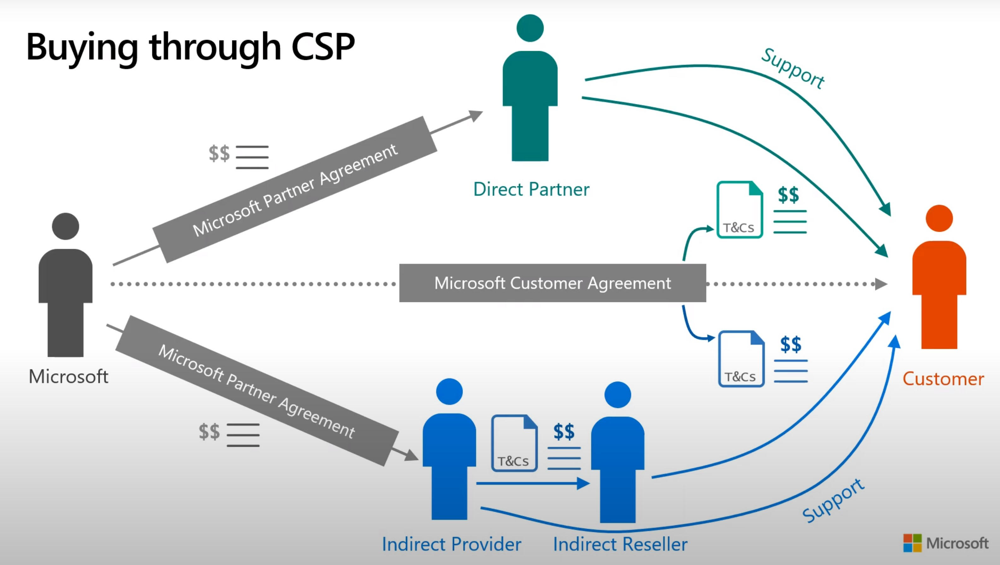

# Cloud Solution Provider Program

[< Back to Crucible](./)

## Purpose

To contribute to the PartnerCrucible, see [Contributor's Guide](ContributorsGuide).

## Business References

Source | Description | Notes
:----- | :-----  | :-----
[Get license Ready](https://getlicensingready.com/)|Training and exam for CSP Licensing Specialist| Requires registration
[Introduction to the CSP Program](https://www.youtube.com/watch?v=EmkNExt58y4)| Video|June 2021 Good walktrhough at ~3 minutes into the video
[Introduction to the CSP Program](https://getlicensingready.com/HandoutStore/Introduction%20to%20CSP%20v21.40.pdf)| CSP 1-pager
[Partner Incentives Overview](https://assetsprod.microsoft.com/en-us/investments-and-incentives-portfolio-overview.pdf)| Partner investments and incentives | FY22

## Partner to Partner
Source | Description | Notes
:----- | :-----  | :-----
[Leverage the Ecosystem (Partner to Partner - P2P)](https://msuspartners.eventbuilder.com/P2Pchannelreadiness) | Partners who adopt an ecosystem business model will grow 50% faster over the next two years than partners who do not. | On-demand
[Partner-to-Partner (P2P) - Channel Transformation](https://partner.microsoft.com/en-us/asset/detail/partner-to-partner-p2p-channel-transformation-mp4)| artner-to-partner (P2P) is the way our partners create scale and accelerate cloud-first adoptions of their solutions, together. We’ve taken the process and broken it down into a series of videos with step-by-step guides. This session is part 1 of an 8-part series on recommendations, tips, and best practices for creating and launching a P2P strategy.| On-Demand
[Scaling cloud solutions to new heights with Microsoft’s partner ecosystem](https://azure.microsoft.com/en-us/blog/scaling-cloud-solutions-to-new-heights-with-microsoft-s-partner-ecosystem/?culture=en-us&country=us) | Blog post and video describing ISV and CSP margin sharing in Marketplace | March 2022
[Independent Software Vendor (ISV) to Partner private offers FAQ](https://learn.microsoft.com/en-us/azure/marketplace/isv-csp-faq)| This article addresses frequently asked questions about Independent Software Vendor (ISV) to Partner private offers in Partner Center.| MS Learn

## Technical References

Source | Description | Notes
:----- | :-----  | :-----
[Admin on behalf of (AOBO)](https://learn.microsoft.com/en-us/shows/cspdev/Module-11-Admin-On-Behalf-Of-AOBO) | AOBO for O365 and Azure | MS Learn
[Providing Support to your customers un CSP ](https://docs.microsoft.com/en-us/partner-center/customer-support)|Description of support requirements under CSP|..|

[< Back to Crucible](./)