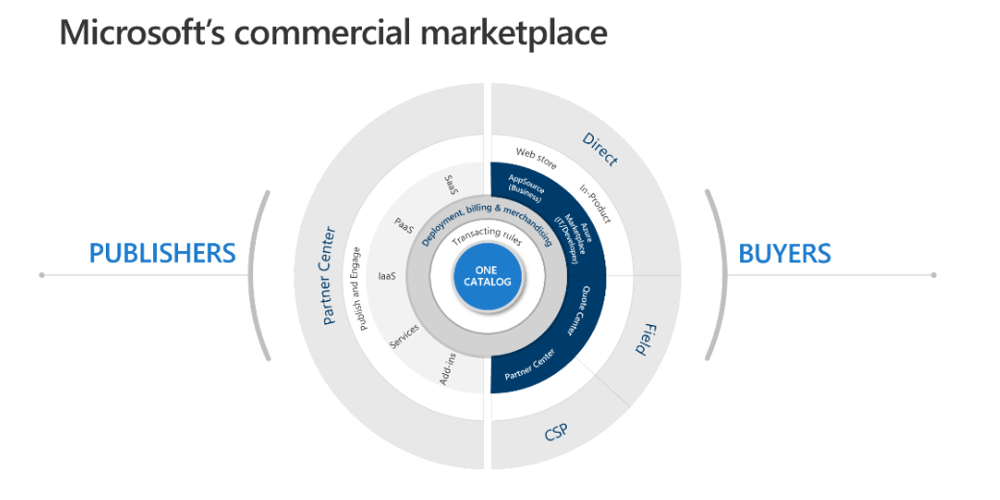

# Commercial Marketplace Offers

## Purpose

 

A Collection of resources for Microsoft Commercial Marketplace Offer development and publication. For a view of other Workloadss, please see the [Taxonomy](./Taxonomy).

To contribute to the PartnerCrucible, see [Contributor's Guide](ContributorsGuide).

## Industry

Source | Description | Notes
:----- | :-----  | :-----
[Forrester Total Economic Impact of Commercial Marketplace ](https://azure.microsoft.com/en-us/blog/the-total-economic-impact-of-the-microsoft-commercial-marketplace/) | Updated - In a 2023 Total Economic Impact™ study commissioned by Microsoft, Forrester Consulting found the Microsoft commercial marketplace delivered customers a 587% return on investment (ROI) with a payback period of less than six months | Forrester
[Marketplace Value Calculator](https://www.microsoft.com/en-us/isv/marketplace/value-calculator?msockid=19ae751b64bd680e0f70619c656e695c) | Use this calculator to discover the value of selling through the Microsoft commercial marketplace.| ISV Hub

## Microsoft Commercial Marketplace

Source | Description | Notes
:----- | :-----  | :-----
[Marketplace Office Hours](https://microsoftcloudpartner.eventbuilder.com/MarketplaceOverviewandQAforPartners) | Explore Live and On-Demand Marketplace Office Hours webinars sessions on business and technical topics; providing publishers with the information and resources to successfully publish their solutions to the Commercial Marketplace | Marketplace
[Mastering the Marketplace](https://microsoft.github.io/Mastering-the-Marketplace/) | Mastering the Marketplace is an on-demand learning library for building transactable offers on the Microsoft commercial marketplace. The library contains self-paced videos, hands-on labs, and sample code designed to help you get your offers onto the marketplace in less time and with more understanding. | Github
[Co-sell opportunities](https://learn.microsoft.com/en-us/partner-center/co-sell-overview#co-sell-opportunities) | A co-sell opportunity is any type of collaboration with Microsoft sales teams, Microsoft partners, or both to sell products and solutions that meet customer needs | MS Learn
[New user experience in Referrals](https://learn.microsoft.com/en-us/partner-center/referrals-user-guide) | This article describes features of the Referrals workspace in Partner Center, including improvements to the Deal Details page in the Co-sell opportunities and Leads sections.| Microsoft Learn

## Multi-Party Private Offers (MPO)

Source | Description | Notes
:----- | :-----  | :-----
[On-demand webinar on multiparty private offers](https://msuspartners.eventbuilder.com/event/74764) | Get an overview of the new multiparty private offer (MPO) functionality coming to marketplace, including operational steps to onboard selling partners to the program. Multiparty party offers enables ISVs to collaborate with their customers’ preferred channel partners, creating personalized offers with custom payouts, while leveraging existing customer cloud commitments (MACC). Explore this highly anticipated functionality and its potential to transform your marketplace channel strategy and unlock incremental business growth. | Webinar
[Multiparty private offer repository](https://aka.ms/MPOEnablementResources) | This collection contains resource materials related to multiparty private offers within the Microsoft commercial marketplace. | Partner
[Multiparty private offers (for selling partners)](https://learn.microsoft.com/en-us/partner-center/marketplace/multiparty-private-offers-for-selling-partners) | Multiparty private offers empower partners to come together, create personalized offers with custom payouts, and sell directly to Microsoft customers with simplified selling through the marketplace. | Microsoft Learn
[Mastering marketplace video series](https://microsoft.github.io/Mastering-the-Marketplace/partner-center/private-offers/) | Private offers in Partner Center | Mastering the Marketplace
[Microsoft Marketplace - Multiparty Private Offers (MPO)](https://www.youtube.com/watch?v=aAD_MhnYGOs) | Find out how Microsoft is making investments to help partners come together and sell custom solutions on the commercial marketplace with multiparty private offers (MPO) | YouTube

## Consulting Offers

Source | Description | Notes
:----- | :-----  | :-----
[Plan a Consulting Services Offer](https://docs.microsoft.com/en-us/azure/marketplace/plan-consulting-service-offer) | This article introduces the different options and requirements for publishing a consulting service offer to the commercial marketplace. | ...
[Commercial Marketplace Certification Policies](https://docs.microsoft.com/en-us/legal/marketplace/certification-policies)| Follow this guidance to ensure offers submitted to the marketplace are approved. | In particular, see:   [- Consulting Service Offers](https://docs.microsoft.com/en-us/legal/marketplace/certification-policies#800-consulting-services)   -[Managed Service Offers](https://docs.microsoft.com/en-us/legal/marketplace/certification-policies#700-managed-services)

## Transactable Marketplace Offers

Source | Description | Notes
:----- | :-----  | :-----
[Step 1. Co-sell requirements - Partner Center](https://learn.microsoft.com/en-us/partner-center/co-sell-requirements) | This article describes the requirements for various levels co-sell status.|  Microsoft Learn
[Step 2. Becoming IP Co-sell Ready and Incentive Eligible - Co-sell requirements](https://learn.microsoft.com/en-us/partner-center/co-sell-requirements#requirements-for-azure-ip-co-sell-incentive-status) | In addition to the offer type requirements listed below, the solution type for your offer must be “IP” in order to be eligible for Azure IP co-sell incentive status | Microsoft Learn
[Step 2b. Reference Architecture Diagrams](https://docs.microsoft.com/en-us/partner-center/reference-architecture-diagram?context=%2Fazure%2Fmarketplace%2Fcontext%2Fcontext)| For *Azure IP solutions*, the diagram should also show how your solution uses Microsoft’s cloud services per the technical requirements of IP Co-sell. It is not designed to assess the quality of the architecture. It is designed to show how your solution uses Microsoft services. |...
[Step 3. Becoming MACC eligible Azure Consumption Commitment enrollment - Azure Marketplace](https://learn.microsoft.com/en-us/azure/marketplace/azure-consumption-commitment-enrollment)|  This article is for commercial marketplace publishers and describes Microsoft Azure Consumption Commitment (MACC),| Microsoft Learn
[Step 4. Create Transactable Offer Microsoft commercial marketplace transact capabilities](https://learn.microsoft.com/en-us/azure/marketplace/marketplace-commercial-transaction-capabilities-and-considerations#transact-publishing-option)|  Choosing to sell through Microsoft takes advantage of Microsoft commerce capabilities and provides an end-to-end experience from discovery and evaluation to purchase and implementation.| Microsoft Learn
[Step 5. Creating a private offer for the customer Private offers in Azure Marketplace - Microsoft marketplace](https://learn.microsoft.com/en-us/marketplace/private-offers-in-azure-marketplace?source=recommendations) | ogether with private plans, private offers allow ISVs to offer custom prices, terms, conditions, and pricing for a specific customer | Microsoft Learn
[Step 6. Billing and invoicing for Azure Marketplace customers - Microsoft marketplace](https://learn.microsoft.com/en-us/marketplace/billing-invoicing?source=recommendations) | This article discusses billing and invoicing information for Azure Marketplace customers. | Microsoft Learn
