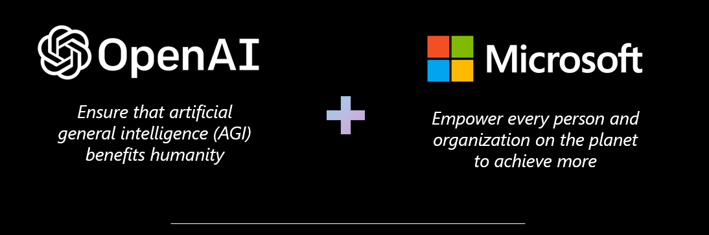

# Data & AI > Azure OpenAI

## Purpose

A Collection of resources for Microsoft practice building leveraging  Azure OpenAI services. For a view of other solution areas, please see the [Taxonomy](./Taxonomy).

To contribute to the PartnerCrucible, see [Contributor's Guide](ContributorsGuide).

## Industry

Source | Description | Notes
:----- | :-----  | :-----
[Gartner Magic Quadrant for Cloud AI Developer Services](https://azure.microsoft.com/en-us/blog/microsoft-is-a-leader-in-the-2023-gartner-magic-quadrant-for-cloud-ai-developer-services/) | Microsoft is recognized as a Leader for the fourth year in a row in the Gartner Magic Quadrant for Cloud AI Developer Services and are especially proud to be placed furthest for our Completeness of Vision.| Gartner
[The CEO’s Guide to the Generative AI Revolution](https://www.bcg.com/publications/2023/ceo-guide-to-ai-revolution) | By François Candelon, Abhishek Gupta, Lisa Krayer, and Leonid Zhukov | BCG
[What every CEO should know about generative AI](https://www.mckinsey.com/capabilities/mckinsey-digital/our-insights/what-every-ceo-should-know-about-generative-ai?cid=app) | Generative AI is evolving at record speed while CEOs are still learning the technology’s business value and risks. Here, we offer some of the generative AI essentials.| McKinsey
[Exploring OpenAI in Financial Services](https://www.youtube.com/watch?v=cN_SP_RAl1c) | he potential for OpenAI in financial services is immense, with opportunities across a wide range of use cases. From fraud detection and risk management to portfolio optimization and customer service, OpenAI has the potential to transform the way financial institutions operate. By leveraging advanced machine learning and natural language processing capabilities, OpenAI can help financial services providers make better decisions, automate processes, and reduce costs. | YouTube
[Advancing human-centered AI: Updates on responsible AI research](https://www.microsoft.com/en-us/research/blog/advancing-human-centered-ai-updates-on-responsible-ai-research/) | he following is a glimpse into the past year’s research for advancing responsible AI with authors from Aether.| Microsoft Research
[Generative AI is here - Does you company have the DNA to make it work?](https://online.flippingbook.com/view/524344474/) | The GenAI DNA Framework presented in this article is intended to help companies reduce risks, increase adoption, accelerate benefits, and achieve the business value desired from GenAI while keeping the frustrations and costs of “random acts of digital” at a minimum. | Cognixia
[AI Anthology](https://unlocked.microsoft.com/ai-anthology/a) | we invited 20 experts, with specialties encompassing a broad spectrum—spanning the fields of business, economics, education, engineering, health, history, law, mathematics, medicine, psychology, and the sciences—to explore the capabilities of GPT-4 and provide their insightful reflections in the form of essays. | Microsoft Unlocked
[AI Business School](https://www.microsoft.com/en-us/ai/ai-business-school) | Online leadership series and learn how to drive business impact by creating an effective AI strategy, enabling an AI-ready culture, innovating responsibly, and more| Microsoft

## Responsible AI

Responsible AI is an approach to assessing, developing, and deploying AI systems in a safe, trustworthy, and ethical manner, and take responsible decisions and actions.

Source | Description | Notes
:----- | :-----  | :-----
[Responsible AI Toolbox](https://responsibleaitoolbox.ai/) | Responsible AI Toolbox is a suite of tools providing a collection of model and data exploration and assessment user interfaces and libraries that enable a better understanding of AI systems. | ResponsibleAIToolbox.ai
[Microsoft’s AI Customer Commitments](https://blogs.microsoft.com/blog/2023/06/08/announcing-microsofts-ai-customer-commitments/) | AI Customer Commitments | Microsoft Blog
[Governing AI: A Blueprint for the Future](https://aka.ms/May25Whitepaper) | A five-point blueprint for the public governance of A| Microsoft
[Responsible AI Resources](https://www.microsoft.com/en-us/ai/responsible-ai-resources) | Explore resources designed to help you responsibly use AI at every stage of innovation - from concept to development, deployment, and beyond.|
[AI-powered content safety](https://azure.microsoft.com/mediahandler/files/resourcefiles/azure-ai-content-safety-ebook/Azure%20Content%20Safety%20eBook.pdf) | An eBook to Build a leading content moderation strategy with AI | Microsoft
[AI for Good Research Lab]([https://www.microsoft.com/en-us/research/group/ai-for-good-research-lab/) | Microsoft’s AI for Good Lab is an applied research and data visualization lab that harnesses the power of big data, and Microsoft’s cloud technology. | Microsoft Research

## Azure OpenAI Practice Building

Source | Description | Notes
:----- | :-----  | :-----
[Partner Data and AI Solution Area Landing](https://partner.microsoft.com/en-us/explore/solution-areas#tab-2) | Lanfin page for partner resources | Partner
[Azure OpenAI Sales Acceleration](https://partner.microsoft.com/en-us/asset/collection/azure-openai-service-sales-acceleration-content#/) | Sales Acceleration content| Partner

## Azure OpenAI Services

Source | Description | Notes
:----- | :-----  | :-----
[What runs ChatGPT?](https://www.youtube.com/watch?v=Rk3nTUfRZmo) | Inside Microsoft's AI supercomputer | Featuring Mark Russinovich - Get an inside look at the AI supercomputer infrastructure built to run ChatGPT and other large language models, and see how to leverage it for your workloads in Azure, at any scale. | Microsoft Mechanics
[Data, privacy, and security for Azure OpenAI Service](https://learn.microsoft.com/en-us/legal/cognitive-services/openai/data-privacy) |This article provides details regarding how data provided by you to the Azure OpenAI service is processed, used, and stored. | Microsoft Learn
[Azure OpenAI Service Documentation](https://learn.microsoft.com/en-us/azure/cognitive-services/openai/) | Learn how to use Azure OpenAI's powerful language models including the GPT-3, Codex and Embeddings model series for content generation, summarization, semantic search, and natural language to code translation. | Microsoft Learn
[Implement logging and monitoring for Azure OpenAI models](https://learn.microsoft.com/en-us/azure/architecture/example-scenario/ai/log-monitor-azure-openai) | This solution provides comprehensive logging and monitoring and enhanced security for enterprise deployments of the Azure OpenAI Service API. | ARchitecture Center
[Plan to manage costs for Azure OpenAI Service](https://learn.microsoft.com/en-us/azure/cognitive-services/openai/how-to/manage-costs) | This article describes how you plan for and manage costs for Azure OpenAI Service.  | Microsoft Learn
[Azure OpenAI Service pricing](https://azure.microsoft.com/en-gb/pricing/details/cognitive-services/openai-service/) |  Optimise costs with a pay-as-you-go consumption model and a price per unit for each model.|
[Request Access to Azure OpenAI Services](https://customervoice.microsoft.com/Pages/ResponsePage.aspx?id=v4j5cvGGr0GRqy180BHbR7en2Ais5pxKtso_Pz4b1_xUOFA5Qk1UWDRBMjg0WFhPMkIzTzhKQ1dWNyQlQCN0PWcu) | Azure OpenAI text and code models: Azure OpenAI Service requires registration and is currently only available to Microsoft managed customers and partners.| Customer Voice
[Azure OpenAI GPT-4 Public Preview Waitlist](https://customervoice.microsoft.com/Pages/ResponsePage.aspx?id=v4j5cvGGr0GRqy180BHbR7en2Ais5pxKtso_Pz4b1_xURjE4QlhVUERGQ1NXOTlNT0w1NldTWjJCMSQlQCN0PWcu) | This form is intended for existing Azure OpenAI customers to join the waitlist for access to the GPT-4 model (preview) in the Azure OpenAI Service.| Customer Voice
[Azure OpenAI Landing Zone reference architecture](https://techcommunity.microsoft.com/t5/azure-architecture-blog/azure-openai-landing-zone-reference-architecture/ba-p/3882102) | In this article, we delve into the synergy of Azure Landing Zones and Azure OpenAI Service, building a secure and scalable AI environment. unpacking the Azure OpenAI Landing Zone architecture, which integrates numerous Azure services for optimal AI workloads. | Tech Community

## Azure OpenAI Learning Path

Source | Description | Notes
:----- | :-----  | :-----
[AI Learning Companion](https://learning-pathways.co.uk/wp-content/uploads/2023/05/AI-Learning-Companion.pdf) | Collection of Microsoft AI learning resouorces by @PaulGriffiths | Learning Pathways
[Partner Learning Plan Resources for Azure OpenAI](https://microsoft.github.io/PartnerResources/azure/data-analytics-ai/openai) | This document is under active development. Please check regularly for updates | Microsoft US
[OpenAI Learning Collection](https://sway.office.com/YLu2lOkCjvtNCHZC?ref=Link) | From Quickstarts to L100, L200, L300, and L400 content| Microsoft GPS Canada
[Introduction to Azure OpenAI Service](https://learn.microsoft.com/en-us/training/modules/explore-azure-openai/) | Understand how you can use Azure OpenAI to build solutions against AI models within Azure.| Microsoft Learn
[Azure OpenAI Workshop](https://github.com/Azure/azure-openai-workshop) | In this workshop, you will learn how to use the Azure OpenAI service to create AI powered solutions. You will get hands-on experience with the latest AI technologies and will learn how to use Azure OpenAI API.| GitHub
[Azure OpenAI Service Playlist](https://www.youtube.com/watch?v=FJ0v3apQ2dM&list=PL8_VXqhvJI9CNF6Q409mSjh0InP6_GfBg) | | YouTube
[ChatGPT & OpenAI powering your apps](https://www.youtube.com/watch?v=3t3qZu1Dy1k) | For your next application, leverage large-scale, generative AI models with a deep understanding of language and code, using Azure’s OpenAI service. Interact with models using natural language, prompts, and few-shot learning. Use the Azure OpenAI Studio to experiment and test your models before bringing them into your code to deliver differentiated app experiences, all with Azure’s enterprise-grade security built-in. | Microsoft Mechanics
[Prompt Engineering 101 - Introduction and resources](https://www.linkedin.com/pulse/prompt-engineering-101-introduction-resources-amatriain/) | By Xavier  (Xavi) Amatriain | LinkedIn
[Prompt Engine](https://github.com/microsoft/prompt-engine) | This repo contains an NPM utility library for creating and maintaining prompts for Large Language Models (LLMs).| GitHub
[The AI Show](https://aka.ms/AIShowsubscribe) | The AI Show Live showcases the amazing work happening in AI at Microsoft. Developers learn what's new in AI in a short amount of time and are directed to assets helping them get started and on the road to success right away. Seth Juarez and friends work on cool projects and highlight what's new in Azure AI and Machine Learning. | Microsoft Learn
[Azure AI Bootcamp](https://vshow.on24.com/vshow/Azure_Depth/registration/22504) | On-demand - learn about Azure artificial intelligence (AI) services designed for developers and data scientists to acquire the knowledge to access and integrate high-quality vision, speech, language, and decision-making AI models through simple API calls in your apps and services and create your own machine learning models with tools like Jupyter Notebooks, Visual Studio Code, and open-source frameworks like TensorFlow and PyTorch.| Learning

## Content Safety

Source | Description | Notes
:----- | :-----  | :-----
[Azure AI Content Safety](https://aka.ms/contentsafety) | Use AI to monitor text and image content for safety.| Azure|
[Tech community blog](https://aka.ms/contentsafety-techblog) | Azure AI Content Safety enables enterprises across various industries to harness the power of Responsible AI, facilitating the creation of secure online spaces and fostering a sense of community.| Tech Community
[Azure AI Content Safety studio](https://aka.ms/contentsafetystudio) | Machine learning assisted moderation APIs that detect material that is potentially offensive, risky, or otherwise undesirable, to assure the contents in community is safe.| Azure
[Introducing Azure AI Content Safety - A new Azure Cognitive Service for content moderation](https://aka.ms/contentsafetydemo) | Introducing Azure AI Content Safety, the content moderation platform that uses AI to identify inappropriate content to create better online experiences for everyone. With advanced language and vision models, AI content classifiers, and content moderation severity scores, you can confidently review content to keep online communities safe.| YouTube

## Copilot

Source | Description | Notes
:----- | :-----  | :-----
[AI apps and copilot framework](https://news.microsoft.com/source/features/ai/microsoft-outlines-framework-for-building-ai-apps-and-copilots-expands-ai-plugin-ecosystem/) | A copilot is an application that uses modern AI and large language models to assist you with a complex cognitive task | Microsoft News
[Semantic Kernel: A Lightweight SDK for LLMs](https://techcommunity.microsoft.com/t5/educator-developer-blog/unlock-the-potential-of-ai-in-your-apps-with-semantic-kernel-a/ba-p/3773847) | Semantic Kernel (SK) is an innovative and lightweight Software Development Kit (SDK) designed to integrate Artificial Intelligence (AI) Large Language Models (LLMs) with conventional programming languages| Tech Community
[Building AI solutions with Semantic Kernel](https://build.microsoft.com/en-US/sessions/31e11443-70d3-4020-8c8c-0a654bccd233?source=sessions) | During this session, learn why we created Semantic Kernel (SK) and how it requires a new kind of developer mindset.  Discover how SK has evolved alongside OpenAI’s GPT-4 trajectory and what plugins will mean. We also discuss early signals we have gathered around SK use for copilots. | Build 2023

## Plugins

Source | Description | Notes
:----- | :-----  | :-----
[ChatGPT Plugins waitlist](https://openai.com/waitlist/plugins) | ChatGPT Plugins will now be available to all ChatGPT plus subscribers, no waitlist required! If you are a developer who has ChatGPT plus and you are interested in making a plugin, please fill out the form below. | OpenAI
[ChatGPT Plugin Quickstart using Python and FastAPI](https://github.com/Azure-Samples/openai-plugin-fastapi) | his is a quickstart for sample for creating ChatGPT Plugin using GitHub Codespaces, VS Code, and Azure. The sample includes templates to deploy the plugin to Azure Container Apps using the Azure Developer CLI. | GitHub

## Development

Source | Description | Notes
:----- | :-----  | :-----
[Azure OpenAI client library for .NET - version 1.0.0-beta.5](https://learn.microsoft.com/en-us/dotnet/api/overview/azure/ai.openai-readme?view=azure-dotnet-preview) | The Azure OpenAI client library for .NET is an adaptation of OpenAI's REST APIs that provides an idiomatic interface and rich integration with the rest of the Azure SDK ecosystem | Microsoft Learn
[Azure OpenAI Service REST API reference](https://learn.microsoft.com/en-us/azure/cognitive-services/openai/reference)| This article provides details on the inference REST API endpoints for Azure OpenAI.| Microsoft Learn

## Labs

Source | Description | Notes
:----- | :-----  | :-----
[AI Hackathon Starter Kit](https://github.com/rohit-lakhanpal/ai-hackathon-starter-kit) | Welcome to the AI Hackathon Starter Kit! This project has been created to make AI accessible and easy for everyone. Whether you are a beginner with no prior experience or an experienced developer, this starter kit is designed to help you incorporate AI into your apps quickly and easily. | GitHub
[Azure OpenAI in-a-day workshop](https://github.com/microsoft/azure-openai-in-a-day-workshop) | In this technical workshop, you will get a comprehensive introduction to Azure OpenAI Service and Azure OpenAI Studio. You will learn how to create and refine prompts for various scenarios using hands-on exercises.| GitHub
[Azure OpenAI Labs](https://github.com/MicrosoftLearning/mslearn-openai/tree/main/Labfiles) | NLP, Prompt Engineering | GitHub

## Azure OpenAI Solution Accelerators

Source | Description | Notes
:----- | :-----  | :-----
[Azure OpenAI Embeddings QnA](https://github.com/ruoccofabrizio/azure-open-ai-embeddings-qna) | A simple web application for a OpenAI-enabled document search. This repo uses Azure OpenAI Service for creating embeddings vectors from documents. For answering the question of a user, it retrieves the most relevant document and then uses GPT-3 to extract the matching answer for the question. |  GitHub
[Customer Service Conversational Insights with Azure OpenA](https://github.com/microsoft/Customer-Service-Conversational-Insights-with-Azure-OpenAI-Services) | The Customer Service Conversational Insights is a solution accelerator built on top of Azure Cognitive Search, Bot Framework, Azure Speech Services and Azure OpenAI that allows customers to quickly deploy an integrated platform and immediately start extracting insights from customer conversations. | GitHub
[Business Process Automation Accelerator](https://github.com/Azure/business-process-automation) | This accelerator provides a no code Studio for users to quickly build complex, multi-stage AI pipelines across multiple Azure AI and ML Services. Users can select, and stack, AI/ML Services from across Azure Cognitive Services (OpenAI, Speech, Language, Form Recognizer, ReadAPI), Azure Machine Learning into a single, fully integrated pipeline. | GitHub
[Project Miyagi](https://github.com/Azure-Samples/miyagi) | Project Miyagi serves as the foundation for an envisioning workshop that reimagines the design, development, and deployment of intelligent applications using Microsoft's Copilot stack | GitHub

## Examples and Demos

Source | Description | Notes
:----- | :-----  | :-----
[Data & AI Industry Partner Activation Kit](https://partner.microsoft.com/en-us/asset/collection/data-and-ai-industry-partner-activation-kit#/) | This collection presents a set of Industry Kits containing key Azure Data & AI Use Cases. Each use case comes with critical resources and information designed to help Partners articulate Microsoft’s Data & AI Industry value proposition and accelerate Azure Data & AI Services growth| Partner
[Data & AI Industry DREAM Demos & DREAM Demo in a Box](https://partner.microsoft.com/en-us/asset/collection/industry-dream-demos-and-dream-demo-in-a-box#/) | Data & AI Industry DREAM Demos are realistic clickable demos based on actual customer engagements that cover a range of industry scenarios in story form. | Partner
[Azure OpenAI Service Generative AI Customer Demo](https://assetsprod.microsoft.com/mpn/en-us/azure-openai-service-chatgpt-tdm-customer-demo.mp4) | Customer-ready customer technical decision maker demo | Partner
[Azure OpenAI Service ChatGPT Customer Demo](https://assetsprod.microsoft.com/mpn/en-us/azure-openai-service-generative-ai-tdm-customer-demo.mp4) | Customer-ready customer technical decision maker demo| Partner
[Azure OpenAI Samples](https://github.com/Azure/openai-samples) | This repo is a compilation of useful Azure OpenAI Service resources and code samples to help you get started and accelerate your technology adoption journey. | GitHub
[Azure Cosmos DB + OpenAI ChatGPT](https://github.com/Azure-Samples/cosmosdb-chatgpt) | This sample application combines Azure Cosmos DB with OpenAI ChatGPT with a Blazor Server front-end for an intelligent chat bot application that shows off how you can build a simple chat application with OpenAi ChatGPT and Azure Cosmos DB.| GitHub
[Document Analysis demo using Azure Form Recognizer and Azure OpenAI](https://microsoft.sharepoint.com/teams/AIEngagements/_layouts/15/stream.aspx?id=%2Fteams%2FAIEngagements%2FShared%20Documents%2FDemos%2FDocument%20Analysis%20demo%20using%20Azure%20Form%20Recognizer%20and%20Azure%20OpenAI%2Emp4) | Document Analysis demo using Azure Form Recognizer and Azure OpenAI|
[Customer Service Conversational Insights with Azure OpenAI](https://github.com/microsoft/Customer-Service-Conversational-Insights-with-Azure-OpenAI-Services) | The Customer Service Conversational Insights is a solution accelerator built on top of Azure Cognitive Search, Bot Framework, Azure Speech Services and Azure OpenAI that allows customers to quickly deploy an integrated platform and immediately start extracting insights from customer conversations.| GitHub
[Podcast Copilot](https://github.com/microsoft/PodcastCopilot) | This code was demonstrated at the Build 2023 keynote by Microsoft CTO Kevin Scott, illustrating the architecture of a Copilot. | GitHub