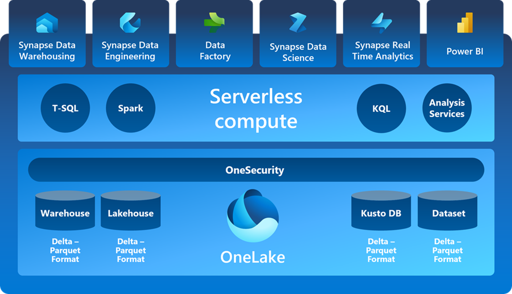

# Data & AI > Microsoft Fabric

## Purpose

A Collection of resources for Microsoft practice building leveraging Fabric. For a view of other solution areas, please see the [Taxonomy](./Taxonomy).

To contribute to the PartnerCrucible, see [Contributor's Guide](ContributorsGuide).

## Industry

Source | Description | Notes
:----- | :-----  | :-----
[Introducing Microsoft Fabric: Data analytics for the era of AI](https://azure.microsoft.com/en-us/blog/introducing-microsoft-fabric-data-analytics-for-the-era-of-ai/) | Announcement - By Arun Ulagaratchagan Corporate Vice President, Azure Data | Azure

## Practice Building

Source | Description | Notes
:----- | :-----  | :-----
[Data analytics for the era of AI](https://build.microsoft.com/en-US/sessions/852ccf38-b07d-4ddc-a9fe-2e57bdaeb613?source=sessions) | From data integration and engineering to data science and business intelligence, find out how next-generation services can transform your data into intelligence and innovation. Also, see how the new AI-infused Copilot experiences accelerate developer productivity while building in security and compliance for your data. | Microsoft Build 2023
[Accelerate your data potential with Microsoft Fabric](https://build.microsoft.com/en-US/sessions/423f41d4-815f-4744-bac0-53d121321cfb?source=sessions) | Bring your data engineers, scientists, and analysts together in new ways and unleash innovation in your organization with a class-leading open and governed solution that truly allows you to do more, with less. | Microsoft Build 2023
[Unlocking Transformative Data Value with Microsoft Fabric](https://info.microsoft.com/ww-landing-unlocking-transformative-data-value-with-microsoft-fabric.html) | ebook - Learn why accessing and managing real-time data in the cloud is key to long-term business success—and see how to get started with a modern analytics solution. | Microsoft
[Microsoft Fabric licenses](https://lnkd.in/dJZiSA2N)| A Microsoft Fabric subscription consists of tenants, capacities, and workspaces and can be organized in various ways according to your organizational needs | Microsoft Learn
[Microsoft Fabric Guided Tour](https://guidedtour.microsoft.com/en-us/guidedtour/microsoft-fabric/microsoft-fabric/1/1) | Guided tour for Microsoft Fabric | Microsoft Guided Tour

## Architecture and best practices

Source | Description | Notes
:----- | :-----  | :-----
[Fabric Readiness](https://github.com/microsoft/Fabric-Readiness/) | The Fabric Readiness repo is designed to enable communities interested in topics and concepts related to Microsoft Fabric. This repository currently provides a collection of presentation decks that are intended to be reused in user groups, online presentations, in-person conferences, and customer conversations.| GitHub
[Microsoft Fabric decision guide: choose a data store](https://learn.microsoft.com/en-us/fabric/get-started/decision-guide-data-store) | Use this reference guide and the example scenarios to help you choose a data store for your Microsoft Fabric workloads. |  Microsoft Learn
[Microsoft Fabric decision guide: copy activity, dataflow, or Spark](https://learn.microsoft.com/en-us/fabric/get-started/decision-guide-pipeline-dataflow-spark) | se this reference guide and the example scenarios to help you in deciding whether you need a copy activity, a dataflow, or Spark for your Microsoft Fabric workloads.| Microsoft Learn
[Create Metadata Driven Data Pipelines in Microsoft Fabric](https://blog.fabric.microsoft.com/en-us/blog/create-metadata-driven-data-pipelines-in-microsoft-fabric?ft=All) | Metadata-driven pipelines in Azure Data Factory and Synapse Pipelines, and now, Microsoft Fabric, give you the capability to ingest and transform data with less code, reduced maintenance and greater scalability than writing code or pipelines for every data source that needs to be ingested and transformed.  | Blog
[Microsoft Fabric: Lakehouse & Medallion Architecture](https://www.youtube.com/watch?v=x_CvCwSbRZI&t=373s) | 
Lakehouses have become a common foundational design pattern for modern data platforms, and have risen in popularity over the last few years after tools like #Databricks, and now #MicrosoftFabric, have standardized on the design. The Medallion Architecture refers to a three-tiered architectural blueprint, with data moving through different stages of state, each stage serving different purposes | YouTube
[Data Factory end-to-end scenario: introduction and architecture](https://learn.microsoft.com/en-us/fabric/data-factory/tutorial-end-to-end-introduction) | This tutorial helps you accelerate the evaluation process for Data Factory in Microsoft Fabric by providing a step-by-step guidance for a full data integration scenario within one hour.| Microsoft Learn
[Using Azure Databricks with Microsoft Fabric and OneLake](https://blog.fabric.microsoft.com/en-us/blog/using-azure-databricks-with-microsoft-fabric-and-onelake?ft=All:) | How does Azure Databricks work with Microsoft Fabric? With the recent announcement of Microsoft Fabric, this question might have appeared in your social media feed. This blog post will answer that question and more details on how the two systems can work together.| Blog

## Access Fabric

Source | Description | Notes
:----- | :-----  | :-----
[Accessing Microsoft Fabric for developers, startups and enterprises](https://blog.fabric.microsoft.com/en-us/blog/accessing-microsoft-fabric-for-developers-startups-and-enterprises?ft=All) | Enabling Microsoft Fabric as a developer, as a startup or as an enterprise has different steps. In this blog, I am covering those steps for all different users. | Blog
[Microsoft Fabric - Free Trial](https://learn.microsoft.com/en-us/fabric/get-started/fabric-trial) | Free Trial| Microsoft

## Skilling

Source | Description | Notes
:----- | :-----  | :-----
[Learn Live: Get started with Microsoft Fabric](https://developer.microsoft.com/en-us/reactor/series/S-1188/) | Whether you're building your career or the next great idea, Microsoft Reactor connects you with the developers and startups that share your goals. Learn new skills, meet new peers, and find career mentorship. Virtual events are running around the clock so join us anytime, anywhere! | Microsoft Reactor
[Introduction to Microsoft Fabric - Webinar series](https://videos.microsoft.com/microsoft-fabric) | Webinar Series | Microsoft Videos
[Get started with Microsoft Fabric](https://lnkd.in/dza3b8ru) | Microsoft Learning path for Microsoft Fabric (9𝐡) | Microsoft Learn
[End-to-end tutorials in Microsoft Fabric](https://learn.microsoft.com/en-us/fabric/get-started/end-to-end-tutorials)  | hese tutorials guide you through a scenario that covers the entire process, from data acquisition to data consumption. Includes: lakehouse, data science, real-time analytics, data warehouse tutorials | Microsoft Learn
[Tutorial: Fabric for Power BI users](https://learn.microsoft.com/en-us/power-bi/fundamentals/fabric-get-started) | In this tutorial, you learn how to use Dataflows Gen2 and Pipelines to ingest data into a Lakehouse and create a dimensional model. | Microsoft Learn
[Webinar Series: Introduction to Microsoft Fabric](https://info.microsoft.com/ww-landing-introduction-to-microsoft-fabric-webinar-series.html?lcid=en-us)| On-demand: Watch this series to learn about the key experiences and benefits of this end-to-end analytics solution | Microsoft Webinars

## Labs

Source | Description | Notes
:----- | :-----  | :-----
[Azure Fabric Labs](https://github.com/MicrosoftLearning/mslearn-fabric/tree/main/Instructions/Labs) | Hands-on labs to Create a lakehouse, Analyze data with Apache Spark, Use delta tables in Apache Spark, Ingest data with a pipeline in Microsoft Fabric, Create a Dataflow (Gen2) in Microsoft Fabric, Analyze data in a data warehouse,  Real-Time Analytics in Microsoft Fabric, notebooks to train a model in Microsoft Fabric  | GitHub
[Unleashing the Power of SynapseML and Microsoft Fabric: A Guide to Q&A on PDF Documents](https://blog.fabric.microsoft.com/en-us/blog/unleashing-the-power-of-synapseml-and-microsoft-fabric-a-guide-to-qa-on-pdf-documents-2/) | In this blog post, we delve into the exciting functionalities and features of Microsoft Fabric and SynapseML to demonstrate how to leverage LLMs to perform question and answer (Q&A) tasks on any PDF document. | Blog

## References

Source | Description | Notes
:----- | :-----  | :-----
[Microsoft Fabric documentation](https://learn.microsoft.com/en-gb/fabric/) | Microsoft Fabric is a unified platform that can meet your organization's data and analytics needs. Discover the capabilities Fabric has to offer, understand how it works, and how to use it.| Microsoft Learn
[Connecting to OneLake](https://blog.fabric.microsoft.com/en-us/blog/connecting-to-onelake) | In this blog, we’ll dive into how to connect and interact with OneLake, including how OneLake achieves its compatibility with any tool used over ADLS Gen2| Blog

## Fabric Community

Source | Description | Notes
:----- | :-----  | :-----
[Fabric Blog](https://blog.fabric.microsoft.com/en-US/blog/) | Microsoft Fabric Blog | Fabric Blog
[Fabric Community](https://community.fabric.microsoft.com/)| Fabric Community is the place for you to ask questions, provide solutions, and build your knowledge.| Microsoft Community
[Introducing Fabric](https://lnkd.in/duxVTQtq) | | BI Polar Blog
[Overcoming the Fear: Exploring Microsoft Fabric from a Power BI Angle](https://lnkd.in/d5D_dnVg) | | Data Marc Blog
[Microsoft Fabric – the first look](https://lnkd.in/dd93-MZF) | | coding family blog
[Microsoft Fabric – Beyond Hype and Marketing!](https://lnkd.in/dH2aq3qT) | | Data Mozart Blog
[Getting Started with Microsoft Fabric: Enabling 60-Day Trial and Analysing Data](https://lnkd.in/dr8SRWBT) | | ServerlessSQL
[Overview of new Microsoft Fabric Power BI Announcements](https://lnkd.in/d7GP4tnx) | | Data Goblins Blog
[Direct Lake: My Favorite Feature in Microsoft Fabric](https://lnkd.in/dBW-K5vB) | | Artis Consulting
[Data Intelligence on light speed: Microsoft Fabric](https://lnkd.in/dNe5mVTD) | | redgate

## Build 2023 Announcements

Source | Description | Notes
:----- | :-----  | :-----
[Administration and Governance in Fabric](https://aka.ms/Fabric-Admin-Gov-Blog) | Fabric provides a unified intelligent data foundation for all analytics workloads and integrates Power BI, Data Factory, and the next generation of Synapse to offer customers an easy to manage, modern analytics solution| Fabric Blog
[Introducing Data Factory in Microsoft Fabric](https://aka.ms/Fabric-Data-Factory-Blog) |  Data Factory in Microsoft Fabric, bringing together the best of Power Query and Azure Data Factory into a single, modern data integration experience which empowers both data and business professionals with capabilities to ingest and transform data as well as orchestrate data workflows. |  Fabric Blog
[Introducing Synapse Data Engineering in Microsoft Fabric](https://aka.ms/Fabric-DE-Blog) | With data engineering as a core experience in Fabric, data engineers will feel right at home, being able to leverage the power of Apache Spark to transform their data at scale and build out a robust lakehouse architecture. |  Fabric Blog 
[Introducing Synapse Data Science in Microsoft Fabricc](https://aka.ms/Fabric-DS-Blog) | Microsoft Fabric, the open Delta Lake support allows data science users to version datasets to create reproducible machine learning code. Additionally, data science users have access to a wide range of easy-to-use getting started experiences, low-code tools and code authoring experiences with Notebooks and Visual Studio Code. Synapse Data Science in Microsoft Fabric also provides a rich set of built-in ML tools. For example, MLFlow model and experiment tracking, powered by Azure machine learning, is built in. The SynapseML Spark library provides scalable ML tools and users can serve predictions swiftly to Power BI with the new PBI Direct Lake capability.| Fabric Blog 
[Introducing Synapse Data Warehouse in Microsoft Fabric](https://aka.ms/Fabric-DW-Blog) | Synapse Data Warehouse is the next generation of data warehousing in Microsoft Fabric that is the first transactional data warehouse to natively support an open data format enabling IT teams, data engineers and business users to collaborate seamlessly and extract actionable insights from their data, all without compromising enterprise security or governance. Just like the previous data warehouse generation, SQL provides multi-table ACID transactional guarantees| Fabric Blog 
[Sense, analyze, and generate insights with Synapse Real-Time Analytics in Microsoft Fabric](https://aka.ms/Fabric-RTA-Blog) |  Real-Time Analytics enables quick access to data insights through automatic data streaming, indexing, and partitioning, and employs auto-generated queries and visualizations, all while preserving powerful analytical capabilities. The platform is optimized for streaming, time-series data, and utilizes a query language and engine with exceptional performance for searching structured, semi-structured, and unstructured data. | Fabric Blog
[Introducing Microsoft Fabric and Copilot in Microsoft Power BI](https://powerbi.microsoft.com/en-gb/blog/introducing-microsoft-fabric-and-copilot-in-microsoft-power-bi/) | Announcement Microsoft Fabric and Copilot in Microsoft
[Driving actions from your data with Data Activator ](https://aka.ms/Fabric-DA-Blog) |  Data Activator is a no-code Microsoft Fabric experience that empowers the business analyst to drive actions automatically from your data | blog 
[Microsoft OneLake in Fabric, the OneDrive for data](https://aka.ms/Fabric-OneLake-Blog) |  OneLake is a complete, rich, ready-to-go enterprise-wide data lake provided as a SaaS service.  | Fabric Blog
[Microsoft 365 data integration in Fabric](https://aka.ms/buil2023-m365-fabric-blog) | icrsoft 365 in the Microsoft Graph for enterprise analytics, we use Microsoft Graph Data Connect which a secure, scalable solution that enables you to copy relevant Microsoft 365 datasets into Microsoft Fabric.| Fabric blog
[Dataverse and Microsoft Fabric integration](https://aka.ms/Dataverse-Fabric-Blog) | “View in Microsoft Fabric” automatically makes all your Dynamics 365 data available for analysis in Microsoft Fabric without having to copy data, build ETL pipelines, or use third-party integration tool | Dynamics Blog
