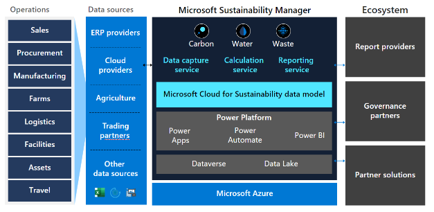

# Industry - Sustainability

## Purpose

A Collection of resources for Microsoft practice building around sustainability. For a view of other solution areas, please see the [Taxonomy](./Taxonomy).

To contribute to the PartnerCrucible, see [Contributor's Guide](ContributorsGuide).

## Industry References

Source | Description | Notes
:----- | :-----  | :-----
[Microsoft Canada - Economic and Social Impact Report ](https://www.microsoft.com/cms/api/am/binary/RE4XblY) | p13. Committing to a Sustainable Future| March 20022 EY
[2022 Environmental Sustainability Report](https://aka.ms/SustainabilityReport2022) | In 2020, we announced that Microsoft will be a carbon negative, water positive, zero waste company that protects ecosystems—all by 2030. Three years into this journey, we continue to make steady progress and remain steadfast in our commitment.| Microsoft
[Microsoft Cloud for Sustainability: Catalyzing progress with our global partners](https://www.microsoft.com/en-us/industry/blog/sustainability/2023/02/28/microsoft-cloud-for-sustainability-catalyzing-progress-with-our-global-partners/#PartnersMakeMorePossible)| Example cloud for sustainability solutions from global partners| Partner Blog
[Industry Resources](https://microsoft.github.io/PartnerResources/industry/)| Industry resources| Microsoft US
[Water replenishment: Our learnings on the journey to water positive](https://query.prod.cms.rt.microsoft.com/cms/api/am/binary/RW1eAAY) | This paper shares our learnings as we developed our global corporate water replenishment program. | Microsoft 

## Skilling

Source | Description | Notes
:----- | :-----  | :-----
[Sustainability Insider Program](https://customervoice.microsoft.com/Pages/ResponsePage.aspx?id=v4j5cvGGr0GRqy180BHbR1nWe0_9tKxEuN9c6D44qtNUOVZZVlpWMDVKVEs5M1dVVkc3TjdSMFpZVSQlQCN0PWcu) | Join the Microsoft Cloud for Sustainability Insider Program | ...
[Azure sustainability guidance Cloud Skills Challenge](https://aka.ms/azure/sustainability/csc) | Azure sustainability guidance Cloud Skills Challenge: this fun, no-cost, interactive program helps skill individuals and teams on Microsoft cloud technologies via a gamified experience utilizing Microsoft Learn content. | MS Learn
[Azure sustainability guidance Microsoft Learn Collection](https://aka.ms/azure/sustainability/collection) | developed as a starting point to help you find relevant learning content on Azure sustainability initiatives, share this with friends and colleagues today and check back for updates in the weeks and months ahead.  | MS Learn
[Principles of Sustainable Software Engineering course](https://learn.microsoft.com/training/modules/sustainable-software-engineering-overview) | This Microsoft Learn module provides a primer on the eight principles of Sustainable Software Engineering, covering a wide range of topics such as electricity and carbon efficiency, carbon intensity, and how to think through the trade-offs required for optimization. Accessible to any level of learner familiar with basic computing concepts. | MS Learn

## Microsoft Cloud for Sustainability

The Industry Cloud portfolio is an extension of Microsoft's existing Cloud services. As such, the Microsoft Cloud for Sustainability is a set of capabilities that runs on Azure.

Component | Description | Notes
:----- | :-----  | :-----
Sustainability manager|Microsoft Sustainability Manager is an extensible solution that unifies data intelligence and offers organizations an increasingly automated and comprehensive view into the emissions impact of their entire operations and value chain. It enables organizations to record and more accurately report their emissions, and continually test and optimize reduction strategies to reach their goals.
Disparate data integration | Microsoft Sustainability Manager helps integrate disparate data from across an enterprise and value chain—from virtually any business system, solution provider, or vendor—and centralizes it with the Microsoft Cloud for Sustainability data model. Microsoft Cloud for Sustainability data model  (new): Cloud for Sustainability water data model (Preview) overview 
Simplified data calculations|It includes built-in calculation methodologies for Scopes 1 and 2 plus several categories of Scope 3.1 Calculation methods for all 15 categories of Scope 3 emissions will be added over time based on the Greenhouse Gas Protocol. (Learn more about emissions scopes.) The nodular structure of Sustainability Manager and Power FX will also enable customers and partners to build complex calculations to address specific needs.
Seamless, embedded collaboration and planning |The integration of Microsoft Teams enables sustainability contributors to seamlessly collaborate around Sustainability Manager data and insights and make detailed, strategic plans within the flow of work—helping streamline and speed up their workflow.2
Platform flexibility and extensibility|Customers and partners can use Microsoft Azure and Power Platform to extend the core capabilities of Sustainability Manager quickly and easily, with custom industry vertical or horizontal solutions, such as new formulas or reports.

Source | Description | Notes
:----- | :-----  | :-----
[Microsoft Cloud for Sustainability](https://partner.microsoft.com/en-us/asset/collection/microsoft-cloud-for-sustainability#/) | Find partner assets for the Microsoft Cloud for Sustainability. | Requires Microsoft AI Cloud Partner Program access
[Introducing critical new water data capabilities in Microsoft Cloud for Sustainability](https://www.microsoft.com/en-us/industry/blog/sustainability/2023/03/22/introducing-critical-new-water-data-capabilities-in-microsoft-cloud-for-sustainability/) | The new capabilities in Microsoft Cloud for Sustainability focus on standardizing water data for water sustainability use cases, providing a single source of truth through multi-source data acquisition and using the purpose-built Microsoft Cloud for Sustainability water data model (preview) to enable efficient calculations, visualization, analysis, and reporting. | 
[Accelerate your journey to net-zero with Microsoft Cloud for Sustainability](https://cloudblogs.microsoft.com/industry-blog/sustainability/2022/06/01/accelerate-your-journey-to-net-zero-with-microsoft-cloud-for-sustainability/) | GA Announcement for Cloud for Sustainability | June 2022
[Scale your business and impact with Microsoft Cloud for Sustainability](https://inspire.microsoft.com/en-US/sessions/1a0cbd11-c641-4ad6-9e8d-04bcf5119ca7?source=sessions) | Environmental sustainability is increasingly becoming a top priority for organizations globally. They are challenged to deliver on their ESG commitments while continuing to balance investments that effect operational excellence, business revenue, market share, and shareholder value. By integrating with Microsoft Cloud for Sustainability, partners have a unique opportunity to help meet the sustainability needs of their customers and grow business. | Inspire 2022   [Ask the experts session](https://inspire.microsoft.com/en-US/sessions/11d98e4a-b519-476b-a1e1-cadc893b08f7?source=sessions)
[Microsoft Cloud for Sustainability Overview](https://docs.microsoft.com/en-us/learn/modules/cloud-sustainability-overview/) | Get trained and co-sell ready: Access training modules at MS Learn |
[Sustainability Cloud on AppSource](https://appsource.microsoft.com/en-us/marketplace/cloudsIndustry?page=1&industry=sustainability)| Cloud fo sustainability services and solutions on AppSource | ...
[Microsoft Cloud for Sustainability Trial](https://aka.ms/solutioncenter) | Microsoft Cloud for Sustainability  offers a free limited trial for 30 days  | Solutions Center
[What's new and planned for Microsoft Cloud for Sustainability](https://learn.microsoft.com/en-us/dynamics365-release-plan/2022wave2/industry-clouds/sustainability/planned-features) | new and planned for Microsoft Cloud for Sustainability |

## Tools and Practices

Source | Description | Notes
:----- | :-----  | :-----
[Improve your energy and carbon efficiency with Azure sustainability guidance](https://azure.microsoft.com/en-us/blog/improve-your-energy-and-carbon-efficiency-with-azure-sustainability-guidance/) | To support you in navigating this learning curve, we’re announcing technical guidance and skilling offerings that can help you plan your path forward, improve your sustainability posture, and create new business value while reducing your operational footprint.|Microsoft Azure
[Sustainability - Well-Architected Review](https://learn.microsoft.com/en-us/assessments/a24b1079-29a4-4d22-b678-376e84884f76/) | Examine your workload through the lens of sustainability. | Microsoft Learn
[Emissions savings estimator for Microsoft Cloud](https://gw.us-il301.gateway.prod.island.powerapps.com/customerenrollmentservice/estimator/index.html) | This information will be used to understand your current on-premises footprint and comparable Azure footprint. | Power app
[Emissions Impact Dashboard for Azure](https://appsource.microsoft.com/en-us/product/power-bi/coi-sustainability.emissions_impact_dashboard) | The Emissions Impact Dashboard provides our cloud customers with transparency into their greenhouse gas emissions associated with cloud usage. Our Generally Available version and is available for anyone to download.| App Source
[Microsoft Solution Center](https://solutions.microsoft.com/) | Ready to set up a new deployment? Choose the cloud solution designed for your industry to get started.
[Industry Cloud Partner Sandboxes](https://experience.dynamics.com/requestlicense/)|This portal is used for SI/ISV Connect partners to obtain free or discounted non-production environment licenses with Biz Apps and Power Platform products to learn, test, and deliver end-to-end customer demos with their own solutions. These offers are to be used only on partner tenants, never on customer tenants.| Includes Cloud for Sustainability, FSI, Healthcare, Retail, Nonprofit

## Sustainability Through Solutions

Source | Description | Notes
:----- | :-----  | :-----
[How IoT, AI, and Digital Twins are helping achieve sustainability goals](https://azure.microsoft.com/en-gb/blog/how-iot-ai-and-digital-twins-are-helping-achieve-sustainability-goals/) | Organizations striving to improve their sustainability can make progress toward those goals by using the Internet of Things (IoT) and AI technology that monitors and analyzes their use of resources and resulting emissions. | Azure Blog
[Well architecture framework for sustainability](https://learn.microsoft.com/en-ca/azure/architecture/framework/sustainability/sustainability-get-started) | This section of the Microsoft Azure Well-Architected Framework aims to address the challenges of building sustainable workloads on Azure. | Microsoft Learn
[Sustainable software engineering practices in Azure Kubernetes Service (AKS)](https://learn.microsoft.com/en-us/azure/aks/concepts-sustainable-software-engineering) | The guidance found in this article is focused on Azure Kubernetes Services you're building or operating on Azure and includes design and configuration checklists, recommended design, and configuration options. | Microsoft Learn