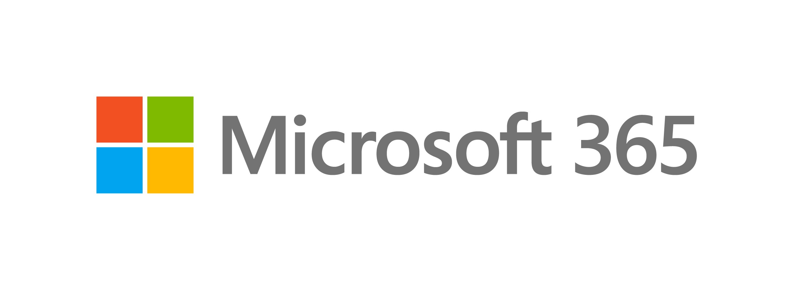

# Modern Work Solution Area

[< Back to Crucible](./)
## Purpose

 
A Collection of resources for Microsoft practice building in the Modern Work solution area. For a view of other solution areas, please see the [Taxonomy](Taxonomy.md). 

To contribute to the PartnerCrucible, see [Contributor's Guide](ContributorsGuide).

## Practice Communities and References

Source | Description | Notes
:----- | :-----  | :-----
[Modern Work partner enablement guide](https://assetsprod.microsoft.com/mpn/en-us/modern-work-partner-enablement.pdf)| Top news, upcoming training, certifications and exams, and additional resources updated ~monthly | Requires MPN login
[Partner Learning](https://readiness.transform.microsoft.com/)| Partner training starting point| Requires MPN login
[M365 Readiness Calendar](https://cloudpartners.transform.microsoft.com/readiness/calendar) | Partner training calendar | Requires MPN login
[Microsoft 365 & Security for Partners](https://cloudpartners.transform.microsoft.com)|Transform for M365 and Security with resources on products, practice development, pre-sales workshops, readiness, events, news, and community | Accessible based on partner competency / PCS
[M365 Partner Community](https://www.yammer.com/office365partners/#/home)|...|
[M365 Partner Community Groups](https://www.yammer.com/office365partners/#/groups/suggested) | Include M365 Lighthouse, Microsoft Desktop Partner, CSP PArtner Community, etc...

## M365 Roadmap and trials

Source | Description | Notes
:----- | :-----  | :-----
[M365 Roadmap](http://aka.ms/M365Roadmap) À Get the latest updates on our best-in-class productivity apps and intelligent cloud services. Rethink productivity, streamline business processes, and protect your business with Microsoft 365.
[Project Orland](https://techcommunity.microsoft.com/t5/small-and-medium-business-blog/project-orland-for-microsoft-365-heads-for-public-preview/ba-p/3571517) | Proactive Customer Lifecycle Management (CLM) increases the lifetime value of your customers by expanding your customer engagements beyond transaction and renewal. By anticipating and responding to your customers' needs, you can improve customer satisfaction, retain subscribers, and grow your business through additional managed services. | July 2022 
[Office 365 / E3 Office 365 E3](https://go.microsoft.com/fwlink/p/?LinkID=403802&clcid=0x1009&culture=en-ca&country=CA)| Microsoft (Free Trial) | .

## Hybrid

Source | Description | Notes
:----- | :-----  | :-----
[How to Hybrid: The WorkLab Guides](https://www.microsoft.com/en-us/worklab/hybrid-work-guides)| Here are your practical guides to in-person and asynchronous collaboration, resetting work-life balance, and getting hybrid meetings right.|...

## Teams

Source | Description | Notes
:----- | :-----  | :-----
[Microsoft Teams Blog](https://techcommunity.microsoft.com/t5/microsoft-teams-blog/bg-p/MicrosoftTeamsBlog)| Welcome to the Microsoft Teams Blog! Learn best practices, news, and trends directly from the team behind Microsoft Teams. | Microsoft blog

## Developers

Source | Description | Notes
:----- | :-----  | :-----
[M365 Development](https://developer.microsoft.com/en-us/microsoft-365/?utm_source=developermscom)| Build collaborative apps for Microsoft 365 and Microsoft Teams that connect people, data, and processes to help users thrive in the hybrid workplace | 
[Microsoft Teams Development](https://developer.microsoft.com/en-us/microsoft-teams?utm_source=developermscom) | Extend and customize the Microsoft Teams developer platform | 

## Viva

Source | Description | Notes
:----- | :-----  | :-----
[Viva Business Learning Path and Assessment](https://partner.microsoft.com/en-US/training/assets/collection/microsoft-viva-employee-experience-business-learning-path#/)| Designed for executives, sales staff and account leads, the Business Rapid Assessment will test your knowledge of employee experience trends, specific Microsoft Viva module offerings, Employee Experience benefits, and more. | -Qualify for Modern Work go-to-market programs like Microsoft Viva workshops and investments to grow your Employee Experience practice
[Viva Technical Learning Path and Assessment](https://partner.microsoft.com/en-US/training/assets/collection/microsoft-viva-employee-experience-technical-learning-path#/)| Created with IT admins and implementation specialists in mind, the Technical Rapid Assessment will test your knowledge of Microsoft Viva module implementation, feature experiences, tech requirements and similar technical necessities.

[< Back to Crucible](./)