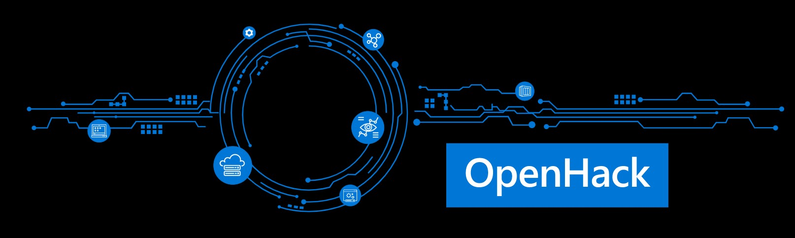

# OpenHack

[< Back to Crucible](./)

## Purpose

Microsoft OpenHack is a developer-focused engagement that connects development teams (Open) with experts to tackle a series of real-world challenges through hands-on experimentation (Hack) in person or online (Virtual).

OpenHack provides a unique and fun upskilling experience for Microsoft employees, customers and partners. Participants work together in teams to complete challenges that increase in complexity and are actively engaged, requiring deep collaboration, as they learn together.

To contribute to the PartnerCrucible, see [Contributor's Guide](ContributorsGuide).

## References

Source | Description | Notes
:----- | :---------- | :-----
[Microsoft OpenHack](https://openhack.microsoft.com/)| Microsoft OpenHack
[OpenHack on Github](https://github.com/microsoft/OpenHack) | OpenHack GitHut Repo
[Fastlane OpenHack](https://www.fastlanetraining.ca/openhack-ca) | OpenHack offered by FastLane (Canada)
[WhatTheHack on GitHub](https://github.com/microsoft/WhatTheHack) | Community driven openhack resources  | ,,,

[< Back to Crucible](./)

