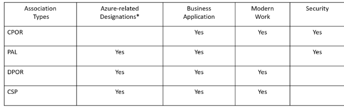

# Practice Building and Profitability

# Purpose

A collection of partner resources related to practice building from profitability and growth, to skilling journeys, to ensuring recognition for your successes.

To contribute to the PartnerCrucible, see [Contributor's Guide](ContributorsGuide).

# Industry References

Source | Description | Notes
:----- | :-----  | :-----
[Microsoft Ecosystem Value: Partner Paths to Profitability and Growth](https://assetsprod.microsoft.com/en-us/idc-report-microsoft-ecosystem-value.pdf) | IDC conducted a study of the Microsoft partner ecosystem globally to understand the various pathways to success and the economic value that can be achieved from engaging with Microsoft and its technology | IDC

# Partner Practice Building References

Pillar | Description | Why? | Next Step
-----: | :---------- | :----- | :-----
**Microsoft Cloud Partner Program (Microsoft AI Cloud Partner Program) membership** | [Partner Center](https://partner.microsoft.com/en-us/dashboard) is the main partner portal provides you access to the tools you need to get work done.| Membership includes [Microsoft AI Cloud Partner Program Benefits](https://learn.microsoft.com/en-us/partner-center/mpn-find-benefits#mpn-benefits) and [Investment and incentives](http://aka.ms/partnerincentives) | - [Become a partner](https://partner.microsoft.com/en-ca/membership)   - Obtain access to [Partner Center](https://partner.microsoft.com/en-us/dashboard), or [raise an issue](https://partner.microsoft.com/en-US/support/?stage=1)   - Ensure Microsoft AI Cloud Partner Program hierarchy of different locations or entities is correct so that all activity is recognized.   - Open a [Partner Center support request](https://partner.microsoft.com/en-US/support/?stage=1) to resolve problems.
**Solution Areas** | [Solution Area Playbooks](https://partner.microsoft.com/explore/solution-areas) | Explore solution plays and curated resources to help develop competitive solutions, serve customers, and grow your business. | - Review [Solution Area Playbooks](https://partner.microsoft.com/explore/solution-areas) that are most relevant to your organisation to unlock incentives.
**Achieve Solution Partner Designation** | Eligibility for Solutions Partner designations is based on your [partner capability score](https://learn.microsoft.com/en-us/partner-center/partner-capability-score). |  Download the [Solutions Partner Benefits Guide](https://aka.ms/Solutionspartner.Benefits) | - Review your **Partner Capability Score (PCS)** in Partner Center.   - Use the [Partner Capability Score Simulator](https://docs.microsoft.com/en-us/partner-center/solutions-partner-insights#score-simulator)   - [Link employee Microsoft Certification profile IDs with Partner Center](https://learn.microsoft.com/en-us/partner-center/ms-learn-associate) to be recognized for skilling achievements.   - [Associate your customer deployments with Partner Center](https://aka.ms/Solutionspartner.Associationsplaybook) to be recognized for your performance and customer growth achievements.
**Achieve Specialisation** | Microsoft specializations build on the related **Solutions Partner designations** in one of the [specialization areas](https://partner.microsoft.com/en-CA/partnership/specialization) |  See [Specialization Benefits Guide](https://aka.ms/Solutionspartner.Benefits) | Use *Partner Center* to [apply for and check the status of specializations](https://learn.microsoft.com/en-us/partner-center/advanced-specializations-apply)
**Marketplace offer** | The Microsoft commercial marketplace is a catalog of solutions from our independent software vendor (ISV) partners and offers from Solution Integrators (SIs).| Accelerate your business in partnership with Microsoft, and to connect Microsoft customers with the best solutions that our partner ecosystem offers.| [Introduction to Listing Options](https://learn.microsoft.com/en-us/azure/marketplace/determine-your-listing-type)   [Partner-Led Marketing Guidelines](https://forms.office.com/pages/responsepage.aspx?id=v4j5cvGGr0GRqy180BHbR9SZm6iKPzNJvudw-PPFJydUNFZOMTJVWlVaOTRHQVQ5RENQMUEwWVdaMC4u)

# Partner Practice Incentive Reinvestment

Microsoft partner benefits, investments, and incentive programs are designed to reward partner when they delivery strategic solutions to exception results for customers.

With the rate technology evolution the only way to stay ahead is to
**reinvest** into your teams. The following are a set of Microsoft partnership incentive reinvestment ideas, and examples where available.

Idea | Description
:----- | :-----
Marketing | Amplify **go-to-market activities** around new **partner designations, specialisations, or marketplace offers**
Innovation / R&D Labs | Accelerate the development of intellectual property by funding **innovation labs**
Skilling | Invest in talent and drive skilling/certification through **learning labs and give-aways** (ie. Surface, Xbox etc.)
Internships | Investing in building workforce of the future by funding **student internships**
Customer Investment Fund | Support for **strategic customer deliveries** through a central pool of project funding

# Partner Practice Skilling and Certifications

Source | Description | Notes
:----- | :-----  | :-----
[Partner Skilling Playbook](https://assetsprod.microsoft.com/mpn/en-ca/partner-skilling-playbook.pdf) | The Partner Skilling Playbook is a guide for understanding the enablement offerings available to help skill up partner organizations, wherever you are in your learning journey.| Partner
[Partner Enablement Newsletter](https://assetsprod.microsoft.com/mpn/en-ca/partner-enablement-newsletter.pdf)| Updated regularly with the partner skilling and enablement live and on-demand events for Microsoft partners. Includes certification preparation and depth enablement sessions across all Microsoft solution areas and Industry Clouds | Partner
[Enablement Guides](http://aka.ms/enablementguides)| These technical and sales guides cover Microsoft solution areas across Modern Work; Microsoft Dynamics 365; Microsoft Power Platform; Microsoft Azure; and Security, Compliance, and Identity. | Microsoft

# Partner to Partner (P2P)

Source | Description | Notes
:----- | :-----  | :-----
[Partner-to-Partner (P2P) Readiness Series for SIs](https://msuspartners.eventbuilder.com/P2Pchannelreadiness) | On-denmand webinar series covering co-sell, partner-to-partner P2P, etc,, | Microsoft US
[Partner-to-Partner (P2P) - Channel Transformation](https://partner.microsoft.com/en-us/asset/detail/partner-to-partner-p2p-channel-transformation-mp4)| Partner-to-partner (P2P) is the way our partners create scale and accelerate cloud-first adoptions of their solutions, together. We’ve taken the process and broken it down into a series of videos with step-by-step guides. This session is part 1 of an 8-part series on recommendations, tips, and best practices for creating and launching a P2P strategy.| On-Demand
[Scaling cloud solutions to new heights with Microsoft’s partner ecosystem](https://azure.microsoft.com/en-us/blog/scaling-cloud-solutions-to-new-heights-with-microsoft-s-partner-ecosystem/?culture=en-us&country=us) | Blog post and video describing ISV and CSP margin sharing in Marketplace | March 2022
[Independent Software Vendor (ISV) to Partner private offers FAQ](https://learn.microsoft.com/en-us/azure/marketplace/isv-csp-faq)| This article addresses frequently asked questions about Independent Software Vendor (ISV) to Partner private offers in Partner Center.| MS Learn

# Partner Association

Source | Description | Notes
:----- | :-----  | :-----
[Grow your partner capability score with partner associations](https://blogs.partner.microsoft.com/mpn/grow-your-partner-capability-score-with-partner-associations/) | Partner associations are how you give Microsoft visibility into the work partners are doing. | Blog
[Partner Association Playbook](https://aka.ms/Solutionspartner.Associationsplaybook) | Associations are the sole mechanism by which customer success, performance, and skilling category points are acknowledged and calculated towards achieving solutions partner designations). | Presentation

## Association Options

### Association Description

Association Type | Description | Guidance
----------------:| :---------- | :-------
**Claiming Partner of Record (CPOR)** | This association connects a partner to a customer tenant and workload based on a claim that the partner submits. Partners submit claims at the workload level via Partner Center, and claims are validated by Microsoft and the customer. **CPOR applies to Microsoft 365 and Dynamics 365**. |  [Customer Association Process Claiming Partner of Record (CPOR)](https://dmspiprod.blob.core.windows.net/templates/CPOR_Claims_Guide.pdf)
**Partner Admin Link (PAL)** | Using PAL, partners can associate their Microsoft AI Cloud Partner Program ID with the credentials used for service delivery whenever they act on behalf of the customer to manage, configure and support **Azure and Business Application services (Power Platform and Customer Insights)**. Unique to PAL is that it allows for *different partners to get recognized for the same customer engagement*. Partners can be associated to the same workloads, and both get ‘credit’. | - [Azure Usage report ](https://learn.microsoft.com/en-us/partner-center/insights-azure-usage-report)  - [Linking a Partner ID with PAL](https://docs.microsoft.com/en-us/partner-center/link-partner-id-for-azure-performance-pal-dpor)  - [Linking a Partner ID to Power Platform or Dynamics Customer Insights](https://docs.microsoft.com/en-us/azure/cost-management-billing/manage/link-partner-id-power-apps-accounts)
**Digital Partner of Record (DPOR)**| Digital Partner of Record (DPOR) is an online capability for customers to attach a servicing partner to their Microsoft cloud subscription. To recognize the partner for that work, the customer adds the partner’s Microsoft AI Cloud Partner Program ID to the subscription via the customer’s service portal. **DPOR applies to Microsoft 365, Dynamics 365, and Azure.** | [Linking and Partner ID with DPOR](https://docs.microsoft.com/en-us/partner-center/link-partner-id-for-azure-performance-pal-dpor)
**Cloud Solution Provider (CSP)** | When a partner sells through the Cloud Solution Provider program, the CSP association type is automatically applied. |

