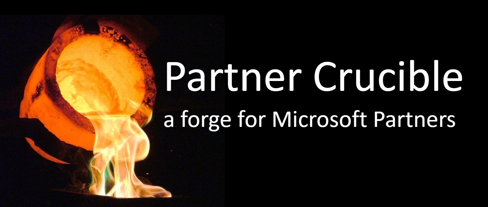

# Partner Crucible

## Purpose 

This project aims to serve as an *entry point* into the wealth of information and services available to Canadian Microsoft partners. The Partner Crucible will curate links, models, and insights to ensure our partners have an overview and a quick path forward. 

## Contributing

This project welcomes contributions and suggestions. 

This project has adopted the Microsoft Open Source Code of Conduct. For more information see the Code of Conduct FAQ or contact opencode@microsoft.com with any additional questions or comments.

## Legal Notices
Microsoft and any contributors grant you a license to the Microsoft documentation and other content in this repository under the Creative Commons Attribution 4.0 International Public License, see the [License](./License/License.md) file, and grant you a license to any code in the repository under the MIT License, see the [License-code](./License/License-code.md) file.

Microsoft, Windows, Microsoft Azure and/or other Microsoft products and services referenced in the documentation may be either trademarks or registered trademarks of Microsoft in the United States and/or other countries. The licenses for this project do not grant you rights to use any Microsoft names, logos, or trademarks. Microsoft's general trademark guidelines can be found at http://go.microsoft.com/fwlink/?LinkID=254653.

Privacy information can be found at https://privacy.microsoft.com/en-us/

Microsoft and any contributors reserve all other rights, whether under their respective copyrights, patents, or trademarks, whether by implication, estoppel or otherwise.