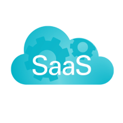

# Software-as-a-Service (SaaS)

## Purpose

A collection of partner resources for build a Software as a Service (SaaS) offerings.

To contribute to the PartnerCrucible, see [Contributor's Guide](ContributorsGuide).

## Practice References

Source | Description | Notes
:----- | :-----  | :-----
[SaaS Academy](https://www.microsoft.com/en-us/saas-academy/main) | Microsoft SaaS Academy brings together best practices and guidance from Microsoft employees, partners and customers to help businesses accelerate their "Software as a Service" journey, addressing both business and technical aspects. | SaaS Academy
[SaaS Partner Guide](https://www.microsoft.com/en-ca/sites/saas-partner-guide/?wt.mc_id=AID3039077_EML_7970401)| The SaaS Partner Guide provides key resources designed to help accelerate application developer and ISV growth. Work with Microsoft specialists for technical or program guidance and discover the many options to build and sell your solutions. |...
[Commercial marketplace transact capabilities](https://learn.microsoft.com/en-us/azure/marketplace/marketplace-commercial-transaction-capabilities-and-considerations) | This article describes pricing, billing, invoicing and payout considerations for transactable offers sold through the commercial marketplace | MS Learn

## Technical References

Source | Description | Notes
:----- | :-----  | :-----
[SaaS Lab](https://github.com/microsoft/saaslab#session-1---the-isv-modernization-journey) | SaaS Lab is a series of sessions that will help you modernize your application to make use of multi-tenant SaaS architecture patterns and technologies in Azure. | GitHub
[Independent software vendor (ISV) considerations for Azure landing zones](https://learn.microsoft.com/en-ca/azure/cloud-adoption-framework/ready/landing-zone/isv-landing-zone?tabs=mg-env-no%2Cminimal) |The landing zones describe how to build an Azure environment with multiple subscriptions. Each landing zone accounts for scale, security, governance, networking, and identity, and is based on feedback and lessons learned from many customers. | Microsoft Lean
[Tenancy models to consider for a multitenant solution](https://learn.microsoft.com/en-us/azure/architecture/guide/multitenant/considerations/tenancy-models) | Guidance for technical decision-makers about the tenancy models you can consider and their tradeoffs | MS Learn
[Azure SaaS Development Kit (ASDK)](https://github.com/Azure/azure-saas) | he Azure SaaS Development Kit is a deployable reference implementation of pre-built modules designed to help you launch your SaaS offering faster | Github
[Community Sample Code and SDK for SaaS Applications](https://github.com/Azure/Commercial-Marketplace-SaaS-Accelerator)| This project is a community-supported reference implementation for integrating Software-as-a-Service (SaaS) solutions with Microsoft commercial marketplace SaaS offers. | Github Version 6.0.0
[Mastering SaaS offers](https://microsoft.github.io/Mastering-the-Marketplace/saas/) | This on-demand learning series includes videos, sample code, and hands-on labs meant to speed your time to publishing your custom SaaS offer on the Microsoft commercial marketplace. If you are building a SaaS offer for the marketplace this learning series is for you. | Mastering Marketplace

