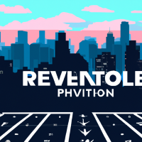

# "Revolutionize Your AI Game with Partner Crucible Updates!"Get ready to take your AI game to the next level! Partner Crucible has just released some game-changing updates that you won't want to miss.First up, we have the [AI Hackathon Starter Kit](https://github.com/rohit-lakhanpal/ai-hackathon-starter-kit), an amazing resource for AI enthusiasts of all skill levels. Designed to make AI accessible and easy to implement, this starter kit is your one-stop-shop for quickly and easily incorporating AI into your apps.But that's not all! Partner Crucible has also added a fantastic [Gartner Magic Quadrant for Cloud AI Developer Services](https://azure.microsoft.com/en-us/blog/microsoft-is-a-leader-in-the-2023-gartner-magic-quadrant-for-cloud-ai-developer-services/) reference, showcasing Microsoft's impressive track record as a leader in Cloud AI Developer Services for the fourth year in a row.And finally, we can't forget about [Microsoft's AI Customer Commitments](https://blogs.microsoft.com/blog/2023/06/08/announcing-microsofts-ai-customer-commitments/). As AI continues to evolve, Microsoft is committed to ensuring their customers are empowered to use AI ethically and responsibly.Don't miss out on these incredible updates! Follow the links above to learn more.

