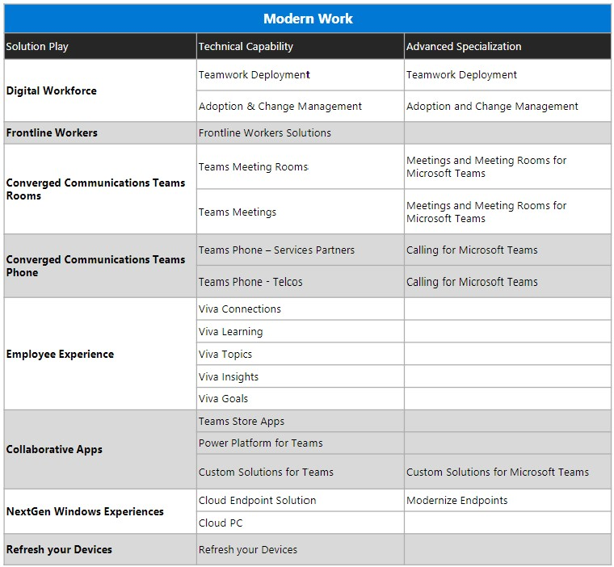
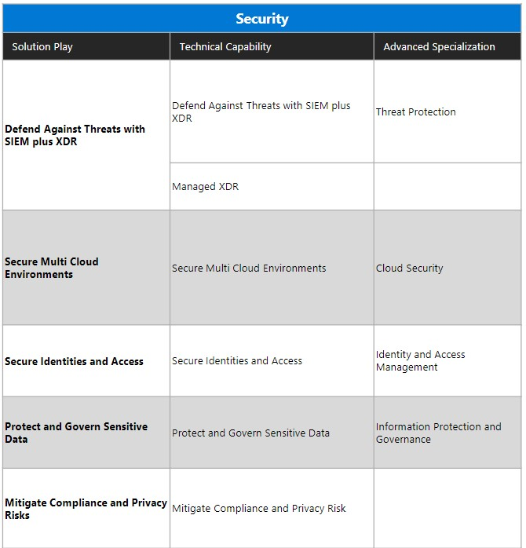
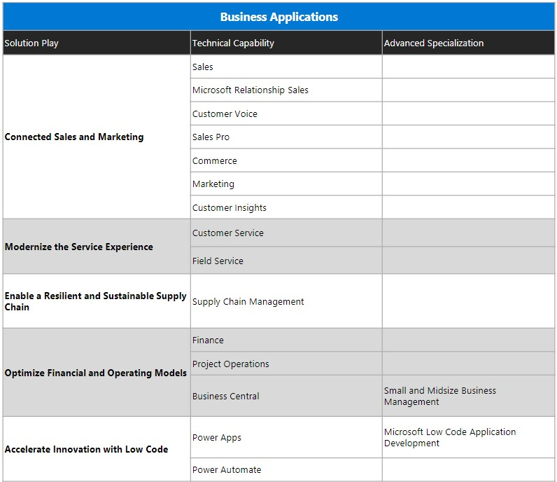
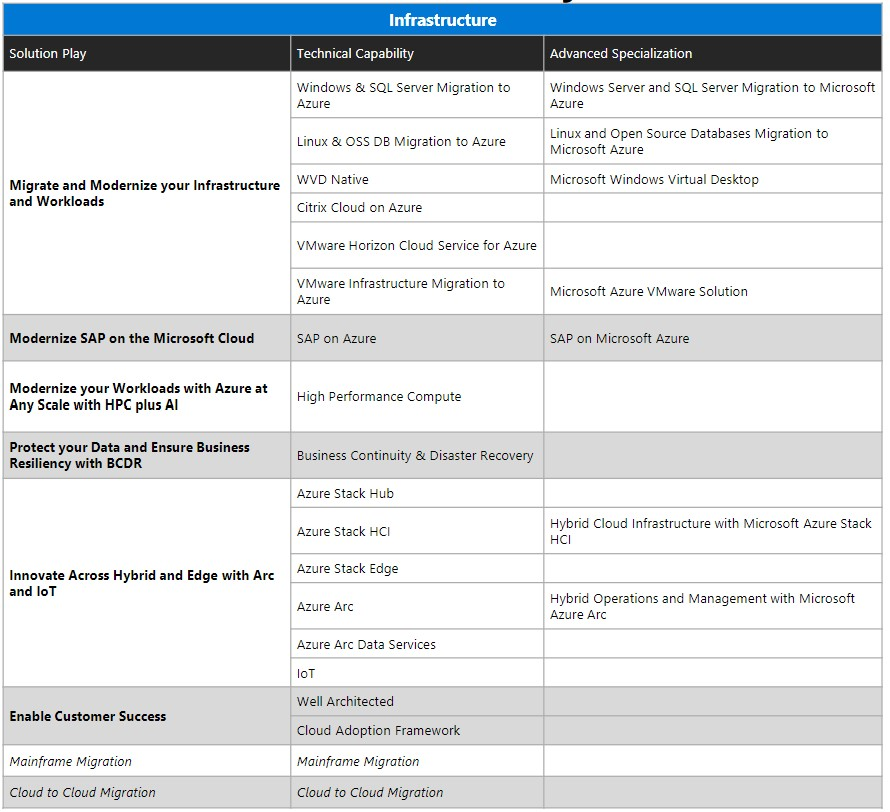
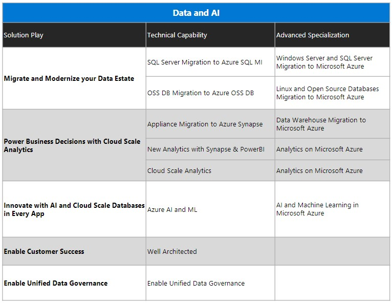
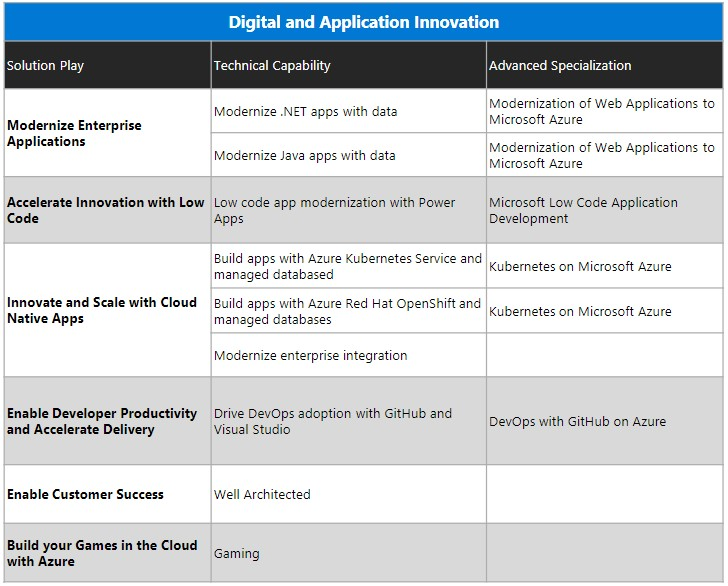

# FY22 Solution Area Taxonomy

## Purpose

FY23 Solution Area Taxonomy

[< Back to Crucible](./)

## References

Source | Description | Notes
:----- | :-----  | :-----
[FY22 Solution Area Partner Taxonomy](https://aka.ms/FY23TaxonomyPartner)|Structure and Definitions for Solution Area and Industry|

[< Back to Crucible](./)
