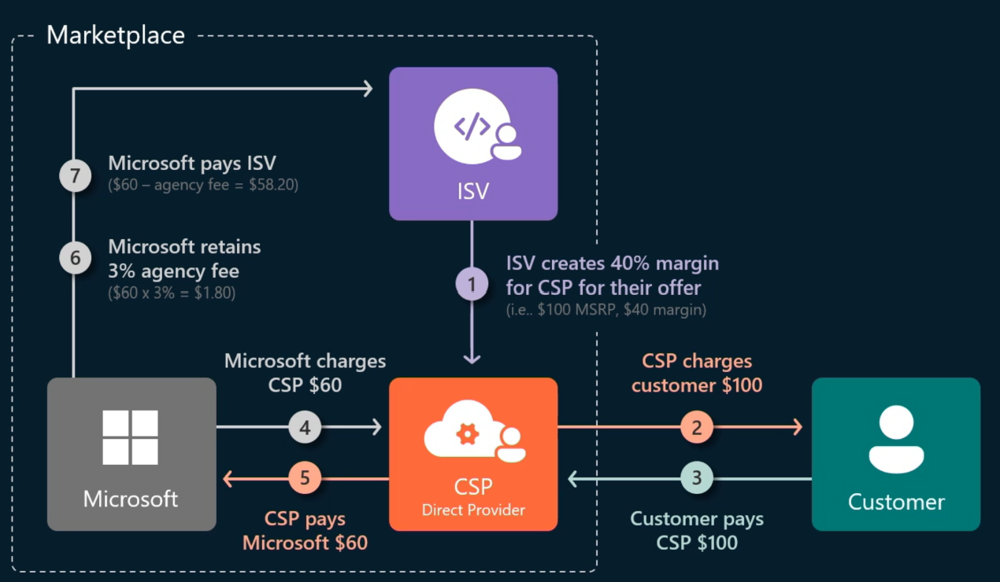

[< Back to Signal:Noise index](/PartnerCrucible/SignaltoNoise)

## TL;DR

*
## Drivers / Triggers of SaaS

## SaaS - more than a technology play

The PartnerCrucible curates a [a set of resources to guide  partners on the SaaS journey](/PartnerCrucible/SaaS). This post aims to fram the journey to SaaS and provide some much needed signal to a noisy field.

This journey to SaaS is often (mistakenly) described as  "*SaaSifying your software solution*". Certainly there are some key technical milestones on the journey to offering SaaS, but there also some critical business milestones as well. Instead, a point of view that reflects the holistic impact of the journey would be "*SaaSifying your business*". 

### Business questions to consider
- what will the per-user subscription model mean for your compensation structure for sales? the low upfront cost of SaaS and a longer tail of monthly / yearly subscriptions. how will your sales organisation rally around SaaS?
- what will the ability to offer a free-trial do to you sales approach and sales cycle? Consulting cycles early to scope
-how will approach customer segments or markets differently? Will this open doors to SMB. Will this give rise to a digital engagement channel for certain segments and markets?
- incorporate aspects of ISV into the services partner org
- what will you support model and customer success look like to ensure long term use of the solutions?
- how will you transition the existing customer base to SaaS?

### Technology questions to consider
- what will the solution lifecycle model look like for you solution(s)?
- how will you transition from a monolith solution to a cloud-based solution? will you partner through P2P motions to get there?
- how will you achieve both scale and still partition customers to ensure privacy and confidentiality?
- how will you harness solution telemetry to guide the evolution of your solution?

## CSP, ISV, and Marketplace, Oh My!
### The model

The following represent the model for *Marketplace private offer with margin sharing*. It is meant to start to get the gears turning and ponder: how might we something like this?

### Marketplace - more that a "listing"

* economic engine that allows direct and bundled tractions to take place
* P2P discovery
-change before publishing

the marketplace allows the service partners to bundle software capabilities, rather than infrastructure, to solve business problems.
Offset the hardware margins with additional customer segments, solving more problems for customers.
Needless to say need to be leveraging platforms with deep partner ecosystems such as Power platform or dynamics 365, Microsoft 365, or Azure.

### Cloud Service Provider (CSP)

Reselling Microsoft, on its own, does not offer many avenues for differentiation. On the other hand, combining ISV offers to solve customer problems is a much higher value proposition that commands significantly higher margins.

### The Independent Software Vendor (ISV)

* IP accelerators, industry focussed, product white space

## Way forward - *Mainstream* path to SaaS

Type | Description | Examples
-----: | :------ | :-------
[SaaS Academy](https://www.microsoft.com/en-us/saas-academy/main) | Microsoft SaaS Academy brings together best practices and guidance from Microsoft employees, partners and customers to help businesses accelerate their "Software as a Service" journey, addressing both business and technical aspects. | SaaS Academy
[Marketplace Summit](https://marketplacesummit.microsoft.com/)| Session recordings are available for you to watch, learn and enjoy! | November 2022
[ISV Success Program](https://www.microsoft.com/en-us/isv) | Build, sell, and thrive on the Microsoft Cloud.| In Private Preview
[Microsoft for Startups](https://foundershub.startups.microsoft.com/signup) | | 

## Way forward - *Insiders* path to SaaS

Type | Description | Examples
-----: | :------ | :-------
[Microsoft Airlift](https://airlift.microsoft.com/) | | Microsoft Airlift

# Get after it

The [PartnerCrucible](https://lagimik.github.io/PartnerCrucible/) hosts a collection of links to key resources for partners. This project aims to serve as an *entry point* into the wealth of information and services available to Canadian Microsoft partners.

[< Back to Signal:Noise index](/PartnerCrucible/SignaltoNoise)