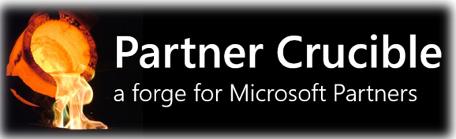

# Partner Crucible

## Purpose 

This project aims to serve as an *entry point* into the wealth of information and services available to Canadian Microsoft partners. The Partner Crucible will curate links, models, and insights to ensure our partners have an overview and a quick path forward. 

This site viewed  times.
(Counter by [CountAPI](https://countapi.xyz/))

See the most recent changes in the [Changelog](./PartnerCrucibleChangelog)

### Innovation
- [Innovation at Microsoft](./InnovationatMicrosoft)
- [Accessibility](./MicrosoftAccessibility
  )  
### Partner Practice Building
- [Partner Portals](./PartnerPortals)
- [Partner Support](./PartnerSupport)
- [Practice Building and Profitability](./PracticeBuilding)
- [Sales Enablement](./SalesEnablement)
- [Learning Resources](./LearningResources)
- [Ressources pour le perfectionnement (français)](./LearningResourcesFrench)
- [OpenHacks](./OpenHack)
- [Sandbox Environments](./SandboxEnvironments)

### Partner Economics
- [ISV](./ISV)
- [Cloud Solution Provider](./CSP)
- [Software as a Service](./SaaS)
- [Commercial Marketplace Offers](./CommercialMarketplaceOffers)
- [FinOps](./FinOps)
  
### Solution Areas
- [Solution Area Taxonomy](./Taxonomy)
- [Solution Partner](./SolutionPartners)
- [Industry Clouds](./IndustryCloud)

### Infrastructure Solution Area
- [Infrastructure](./AzureInfrastructureSolutionArea)

### Security Solution Area
- [Security](./SecuritySolutionArea)
- [Sentinel Demos](./SecuritySolutionArea-SentinelDemos)
- [Azure Defender for IoT](./AzureDefenderIoT)

### Business Applications Solution Area
- [Business Applications Solution Area](./BusinessApplicationsSolutionArea)

### Data and AI Solution Area
- [Data and AI solution Area](./DataAISolutionArea)
  
### Power Platform Solution Area
- [Power Platform Solution Area](./PowerPlatformSolutionArea)

### Digital and Applications Innovation
- [Digital and Applications Innovation Solution Area](./DigitalAppsandInnovationSolutionArea)
- [AI and IoT Insider Lab](./AIIOTInsiderLab)
- [Mixed Reality](./MixedReality)
  